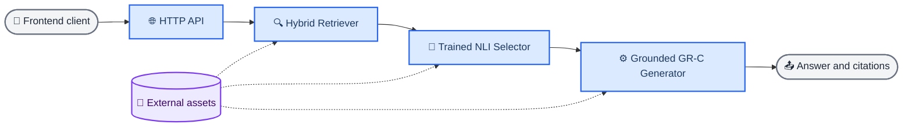

# Evidence RAG

Evidence RAG is a research software release for evidence-grounded question answering. Its final
runtime is a **Hybrid Retriever → trained NLI Selector → grounded GR-C Generator** pipeline with a
versioned HTTP interface, reproducible aggregate results, and explicit negative findings.

The repository contains source, tests, portable configuration, compact result aggregates, and
asset checksums. Model weights, raw datasets, indexes, and per-query outputs remain outside Git.

## 🚀 Quick start

Python 3.11 is required. The CPU smoke uses deterministic test doubles, downloads nothing, and
does not require a GPU:

```bash
git clone https://github.com/M1yanoShiho/IBM_Granite_Project.git
cd IBM_Granite_Project
python3.11 -m venv .venv
source .venv/bin/activate
python -m pip install -e '.[dev,api]'
evidence-rag-smoke
```

A successful run prints a JSON trace with ten retrieved candidates, the misleading fixture
removed by the Selector, and an answer that cites only the retained clean evidence. See the
[setup guide](docs/setup.md) for Windows activation, development checks, and real-model setup.

## 🏗️ Architecture

The browser or API client never loads model files. The backend owns the external assets and passes
immutable evidence records through the three modules.



The Pipeline resolves selected IDs back to the Retriever's original evidence and prevents the
Generator from citing unselected evidence. The [architecture guide](docs/architecture.md) defines
the module contracts, runtime loading, and front-end boundary.

## 🌐 Run the HTTP API

UI work can use [the committed mock response](examples/mock_frontend_response.json) without any
models. For an integrated backend, first configure the authorized assets described in
[models and data](docs/models-and-data.md), then run:

```bash
set -a
. ./.env.local
set +a
evidence-rag-serve --host 127.0.0.1 --port 8000 \
  --allow-origin http://localhost:3000
```

The service exposes `GET /health` and `POST /v1/query`. The pipeline loads lazily on the first
query. The frozen request, response, citation, and error schemas are documented in the
[front-end integration guide](docs/frontend-integration.md).

## 📊 Research evidence

The release reports technical completion separately from scientific support:

| Evaluation | Frozen outcome |
|---|---|
| Selector misleading-evidence stress test | Evidence-level gate passed for the tested seeds. |
| Selector blind answer gate | Failed; the interval crossed zero and the decision remained `KEEP_TOPK10`. |
| Experiment 04 | Protocol completed, but the registered whole-system RAR superiority claim was not supported. |
| Experiment 05 | Protocol completed with 12,000 scored outputs, but registered Claims A and B were both `NOT SUPPORTED`. |

`FINAL PASS` in an audit means that the registered protocol executed successfully; it does not
mean that a superiority claim passed. Read the [results](docs/results.md) and
[limitations](docs/limitations.md) before citing performance. The
[reproducibility map](REPRODUCIBILITY_MAP.md) links every public claim to code, configuration,
frozen inputs, result files, and the immutable archive reference.

## 🧪 Reproduce the public tables

The checked-in aggregate inputs are sufficient to rebuild the dissertation tables without model
weights or restricted raw outputs:

```bash
python experiments/experiment04/build_tables.py --output-dir build/experiment04
python experiments/experiment05/build_tables.py --output-dir build/experiment05
pytest -q tests/evaluation/test_public_table_rebuild.py \
  tests/evaluation/test_public_selector_results.py \
  tests/experiments
```

The [reproduction guide](docs/reproduction.md) distinguishes public table verification from full
raw recomputation and model training.

## 📁 Repository map

```text
configs/       Frozen runtime, model, Selector, and experiment configuration
docs/          Setup, architecture, results, limitations, and model cards
examples/      API client and model-free front-end fixture
experiments/   Public training/evaluation entry points and table builders
results/       Small audited aggregates used by the dissertation
scripts/       Final experiment and artifact verification utilities
src/           Installable evidence_rag package and HTTP API
tests/         Unit, contract, integration, research, and documentation tests
```

The full development record remains recoverable from `research-archive-2026-08-25`; the release
tree intentionally omits obsolete stages and large raw artifacts.

## 📚 Documentation

- [Documentation index](docs/README.md)
- [Setup](docs/setup.md)
- [Architecture](docs/architecture.md)
- [Models and data](docs/models-and-data.md)
- [Reproduction](docs/reproduction.md)
- [Results](docs/results.md)
- [Limitations](docs/limitations.md)
- [Contributing](CONTRIBUTING.md)

## 📝 Citation and license

Use the machine-readable metadata in [CITATION.cff](CITATION.cff) and the contributor policy in
[AUTHORS.md](AUTHORS.md). Project-authored code is released under the [MIT License](LICENSE).
Third-party models and datasets retain the separate terms recorded in
[models and data](docs/models-and-data.md).
