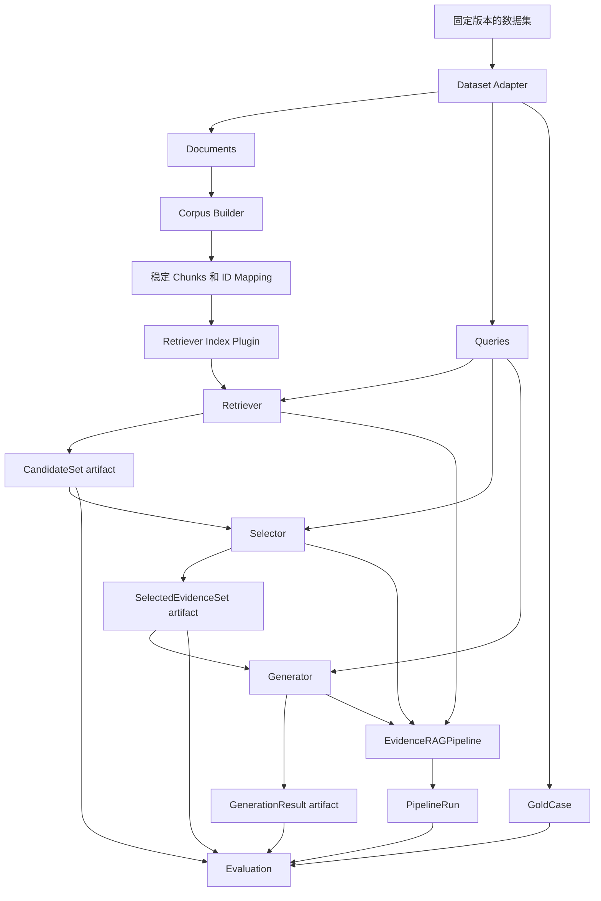

# 三模块共享数据与实验基础设施计划及执行记录

本文是本次共享基础设施工作的唯一记录，集中保存最初计划、设计决定、实际命令、执行状态、测试结果和当前限制。不要把本次工作的相同内容复制到其他计划或说明文档中。

## 1. 目标

只建设一套公共基础设施，同时支持两种工作方式：

1. Retriever、Selector、Generator 使用同一个数据集独立开发和实验。
2. 三个模块不改内部代码，直接连接成完整 RAG Pipeline，运行同一数据集并统一评估。

完成后的关系是：

```text
共享数据与实验基础设施
    ├── 数据集加载、版本和稳定 ID
    ├── 文档切片与语料快照
    ├── 实验配置和中间产物
    └── 独立 runner、Pipeline runner、Evaluation
                    │
                    ▼
Retriever  ──>  Selector  ──>  Generator
```

公共基础设施不是第四个 RAG 业务模块。它只准备数据、保存产物和组织实验，不实现检索、选择或生成算法。

## 2. 三个模块如何共同使用

| 模块 | 从公共层读取 | 向公共层写入 |
| --- | --- | --- |
| Retriever | `Documents`、语料切片、`Queries`、实验配置 | `CandidateSet`、检索指标 |
| Selector | `Queries`、冻结的 `CandidateSet`、实验配置 | `SelectionResult`、`SelectedEvidenceSet`、选择指标 |
| Generator | `Queries`、冻结的 `SelectedEvidenceSet`、实验配置 | `GenerationResult`、生成指标 |
| 完整 Pipeline | 同一数据集和三个模块配置 | `PipelineRun`、完整系统指标 |

切片和索引虽然由公共基础设施统一组织，但使用边界不同：

- 文档加载、切片规则、稳定 ID 和语料版本是公共能力。
- 索引构建入口、保存位置和版本记录是公共能力。
- BM25、FAISS、SPLADE 等具体索引实现属于 Retriever 插件。
- Selector 和 Generator 不直接查询索引，只读取标准的模块输入。

这样既不会重复准备数据，也不会破坏三个模块的独立性。

### 2.1 数据集使用规则

- 独立开发时，Retriever、Selector、Generator 可以各自使用不同数据集。
- 新数据集必须转换为本模块使用的公共 schema，并生成自己的 dataset signature。
- Selector 可以直接读取符合 schema 的冻结 `CandidateSet`；Generator 可以直接读取符合 schema 的冻结 `SelectedEvidenceSet`，不要求现场运行上游模块。
- 做完整 Pipeline 测试时，三个模块必须使用同一次 `prepare` 产生的数据、切片、ID 和索引，不能跨数据集拼接。
- 做三模块横向比较时，应使用同一个固定数据集和 split，保证指标可比较。

## 3. 统一数据流



独立实验读取冻结 artifact；完整实验通过 Pipeline 实时调用三个模块。两种方式必须使用相同的数据签名、ID 和 schema。

## 4. 需要建设的公共能力

### 4.1 一个共同参考数据集

第一版真实参考数据集固定为 `ir_datasets==0.5.11` 提供的 `beir/scifact/test`，不同时建设多个 benchmark adapter。完整数据确定性 materialize 到被 Git 忽略的 `data/benchmarks/scifact/test/`，不会提交进仓库。

仓库中的 `tests/fixtures/reference_dataset/` 是使用同一 `Document`/`Query`/`GoldCase` JSONL schema 的小型合成 CI fixture。它只用于接口和工作流回归，不是 SciFact 子集，也不代表真实 benchmark。`configs/experiments/reference_baseline.toml` 指向该 fixture；`configs/experiments/scifact_reference.toml` 指向本地完整 SciFact materialization。

必须固定：

- 数据集名称和版本
- train/dev/test 或固定 dev split
- 文档、问题和标签的位置
- 数据下载或共享存储说明
- 一个来自同一 schema 的小型 CI fixture

大文件不提交 Git；materializer、schema、真实实验配置和小型 fixture 提交 Git。真实 SciFact 的本地 `manifest.json` 记录 `beir/scifact`、`test` 和 `ir-datasets-0.5.11`，文档 `source_uri` 记录 benchmark/split/document ID，构成可重建的数据来源说明。

BEIR SciFact 的文档按非空 `title`、正文顺序用一个空行连接，只清理两部分的首尾空白。SciFact query 没有标准答案文本，所以真实参考实验的 answer-match 保持明确未评分；它验证检索、选择、引用和最终证据召回，不伪造生成答案标签。小型 CI fixture 负责验证有答案标签时的完整评测代码路径，后续生成质量实验必须另选带标准答案的数据集。

### 4.2 Dataset Adapter

把原始数据统一转换成当前 contract：

```text
原始文档 -> Document
原始问题 -> Query
原始标签 -> GoldCase
```

第一版只实现参考数据集实际需要的格式。如果该数据集使用 PDF，就增加最小 PDF 加载能力；如果已经提供纯文本，就不提前建设完整多模态 loader。

adapter 必须验证：

- `document_id` 和 `query_id` 唯一
- `GoldCase.query_id` 能找到对应 `Query`
- 标签里的文档 ID 确实存在
- 空文档、空问题和损坏样本明确失败

所有 dataset boundary 的 ID 和文本只去掉首尾空白，保留有意义的内部空白。纯空白 document、query、reference answer 或 ID 必须明确失败。SciFact materializer 只保留正 qrel；query limit 按规范化后的 query ID 排序并验证范围，同时保留完整语料并确认所有 gold document 存在。

### 4.3 Corpus Builder

公共 Corpus Builder 负责：

- 文本规范化
- 文档切片
- 稳定 `document_id`、`chunk_id`、`evidence_id`
- 保存 chunk 到原文档的映射
- 生成可复现的 corpus signature

第一版可以继续使用当前 `WordChunker`，但必须记录 `chunk_size`、`overlap` 和 chunker version。token-aware、结构感知或多模态切片后续作为可替换实现测试，不作为当前前置条件。

### 4.4 Index 接口和插件边界

公共层通过 `composition.prepare_retriever_index()` 组织索引构建和加载，Retriever 插件实现统一的 `build`/`load` 入口：

```text
build(corpus_snapshot, directory, *, k1, b) -> Retriever
load(directory, *, expected_corpus_signature, expected_k1, expected_b) -> Retriever
```

已实现的 v1 边界是：

- `src/evidence_rag/retriever/indexing.py` 提供 `BM25IndexPlugin`。
- `index/index_manifest.json` 记录 schema `1.0`、实现 `bm25`、实现版本 `bm25-v1`、corpus signature、`k1`、`b`、snapshot 文件名和确定性 index signature。
- `index/corpus_snapshot.json` 保存 typed corpus snapshot；两个文件均使用 canonical JSON。
- 加载时验证 manifest、期望的 corpus signature 和 BM25 参数、snapshot corpus signature 及 index signature，任何不匹配都在检索前失败。
- v1 从持久化 snapshot 重建内存 BM25 scoring tables，不保存 FAISS 风格的 numeric index structures。
- FAISS、StrongBM25、SPLADE、Hybrid 后续按实验需要增加，不在 v1 范围内。

Selector 和 Generator 不依赖任何索引类。

### 4.5 公共 artifact 格式

统一使用 Pydantic JSON/JSONL 序列化，保存：

```text
run_manifest.json
queries.jsonl
gold_cases.jsonl
candidate_sets.jsonl
selection_results.jsonl
selected_evidence_sets.jsonl
generation_results.jsonl
pipeline_runs.jsonl
evaluation_report.json
```

真实实验产物放 `runs/`；小型测试 artifact 放 `tests/fixtures/`。

`run_manifest.json` 至少记录：

- dataset ID、版本、split 和 signature
- corpus/chunker/index 配置和 signature
- contract/schema 版本
- 模块名称和配置
- `top_k`、`max_selected`、随机种子
- Git commit

runner 必须拒绝混用不同数据、切片或 schema 生成的 artifact。

每个冻结 artifact 旁边保存 `<artifact>.metadata.json` provenance sidecar，绑定 artifact 内容 hash、dataset/corpus signature、run manifest signature、producer、stage 和上游 artifact hashes。`run_manifest.json` 记录 `prepare` 时固定的数据、语料、索引和基线来源；每个 sidecar 的 `producer_provenance` 则记录该 stage 实际运行时的 Git commit、dirty 状态、源码签名、模块配置和执行参数。

这两层 provenance 的边界保证模块可以独立开发：Selector 或 Generator 修改自己的代码和配置后，仍可读取数据、语料和 schema 一致的冻结上游 artifact，并在新输出 sidecar 中记录自己的新版本；它们不会因为整个源码树与 `prepare` 时不同而被错误阻断。Retriever 和实时 Pipeline 还会额外验证持久化索引及 Retriever 配置。冻结 baseline 的含义是下游可以独立验证并读取上游产物，而不是重新调用上游模块。小型 CI 数据对应的冻结链提交在 `tests/fixtures/reference_baseline_artifacts/`；真实 SciFact 的 artifact 与 sidecar 保存在被忽略的 `runs/`，不提交 Git。

### 4.6 四种 runner

公共实验层提供以下实际命令：

```bash
python -m evidence_rag.cli.experiment --config configs/experiments/reference_baseline.toml prepare
python -m evidence_rag.cli.experiment --config configs/experiments/reference_baseline.toml retriever
python -m evidence_rag.cli.experiment --config configs/experiments/reference_baseline.toml selector
python -m evidence_rag.cli.experiment --config configs/experiments/reference_baseline.toml generator
python -m evidence_rag.cli.experiment --config configs/experiments/reference_baseline.toml pipeline
python -m evidence_rag.cli.experiment --config configs/experiments/reference_baseline.toml all
```

默认输出目录是 `runs/reference-baseline/`。`prepare` 创建基础 artifact 和 `index/`；`retriever` 读取持久化索引；`selector` 与 `generator` 只读取冻结上游 artifact；`pipeline` 使用同一个持久化索引实时连接三模块；`all` 依次运行全部步骤。

除 `all` 外，所有运行命令都要求先显式执行 `prepare`。只有 `prepare` 可以创建索引；Retriever 和 Pipeline 在索引缺失或不兼容时明确失败，不在运行期重建。没有 provenance sidecar 的旧运行目录必须归档后重新准备，不能与新 artifact 混用。

真实 SciFact 从安装到运行的规范命令是：

```bash
python -m pip install -e '.[dev,benchmark]'
evidence-rag-materialize-benchmark scifact --split test --output data/benchmarks/scifact/test
evidence-rag-experiment --config configs/experiments/scifact_reference.toml prepare
evidence-rag-experiment --config configs/experiments/scifact_reference.toml retriever
evidence-rag-experiment --config configs/experiments/scifact_reference.toml selector
evidence-rag-experiment --config configs/experiments/scifact_reference.toml generator
evidence-rag-experiment --config configs/experiments/scifact_reference.toml pipeline
```

小型 CI fixture 继续使用 `configs/experiments/reference_baseline.toml`，不能把它的结果标成 SciFact benchmark。

独立 runner 的要求：

- Retriever runner 不调用 Selector 或 Generator。
- Selector runner 不实例化 Retriever、不访问索引。
- Generator runner 不调用 Retriever 或 Selector。
- Gold label 只交给 evaluator，不能作为模块算法的输入。

Pipeline runner 的要求：

- 根据配置从 `composition.py` 创建三个模块。
- 对每个 `Query` 调用 `run_with_trace()`。
- 保存每一阶段的真实输出。
- 统一调用 Evaluation 生成报告。

### 4.7 公共 Evaluation

同一评测层同时支持模块实验和完整系统实验：

| 范围 | 第一版指标 |
| --- | --- |
| Retriever | document recall，必要时增加 Recall@K/MRR |
| Selector | conditional document recall、document precision |
| Generator | 有答案标签时的 conditional answer match、引用合法性和引用 precision |
| 完整系统 | final document recall、有答案标签时的 answer match、cited document precision |

完整评测直接读取 `PipelineRun`；三个独立 stage evaluator 分别直接读取 `CandidateSet`、`SelectedEvidenceSet` 和 `GenerationResult`，不会为单模块评分伪造其他阶段输出。

## 5. 建议目录

```text
src/evidence_rag/
  infrastructure/
    benchmarks.py        # 可选 BEIR/SciFact materializer（惰性加载 ir_datasets）
    datasets.py          # Dataset Adapter
    corpus.py            # 切片、ID mapping、corpus snapshot
    artifacts.py         # JSON/JSONL 和 manifest
    config.py            # 公共实验配置

  retriever/
    chunking.py
    indexing.py          # Retriever 索引接口和插件

  evaluation/
    stage_evaluators.py
    runners.py           # 三个独立 stage runner
    experiment.py        # artifact 工作流 + Pipeline runner

  cli/
    materialize_benchmark.py
    experiment.py

configs/experiments/
  reference_baseline.toml
  scifact_reference.toml

tests/fixtures/
  reference_dataset/
  reference_baseline_artifacts/
```

依赖规则：

```text
infrastructure -> contracts
Retriever       -> contracts + infrastructure corpus/index interface
Selector        -> contracts
Generator       -> contracts
Evaluation      -> contracts + infrastructure + 三个模块的公开 Protocol
Pipeline        -> 三个模块的公开 Protocol
```

Selector 和 Generator 不反向依赖 `retriever` 或索引实现。

## 6. 执行顺序

### 阶段 1：固定数据和公共 schema

任务：

1. 选择一个共同参考数据集和固定 split。
2. 建立 dataset manifest 和小型 CI fixture。
3. 完成 Dataset Adapter。
4. 验证 `Document`、`Query`、`GoldCase` 的 ID 对齐。

完成标志：同一数据集能够被稳定转换为三个模块和评测层认识的输入。

### 阶段 2：建立 Corpus Builder 和 baseline index

任务：

1. 建立文本规范化和 Corpus Builder。
2. 固定 document/chunk/evidence ID 规则。
3. 保存 corpus manifest 和 ID mapping。
4. 用当前 `WordChunker + BM25Retriever` 建立第一版 baseline。
5. 增加重复运行 ID 与 signature 一致性测试。

完成标志：Retriever 可以基于公共语料直接进行真实数据实验。

### 阶段 3：建立 artifact 和独立 runner

任务：

1. 实现 artifact 读写与 signature 校验。
2. 实现 Retriever runner 并冻结 baseline `CandidateSet`。
3. 实现 Selector runner 并冻结 baseline `SelectedEvidenceSet`。
4. 实现 Generator runner。
5. 实现三个 stage evaluator。

完成标志：三个模块的人都可以使用同一个数据集独立开发和评估，不需要等待其他模块现场运行。

### 阶段 4：建立完整 Pipeline runner

任务：

1. 建立统一实验配置。
2. 从配置创建 Retriever、Selector、Generator。
3. 实时运行 `EvidenceRAGPipeline.run_with_trace()`。
4. 保存完整 `PipelineRun` 和统一评测报告。
5. 验证只替换一个模块时，另外两个模块不需要修改。

完成标志：三个最新模块能够在同一参考数据集上直接组成完整 RAG 系统并完成评估。

### 阶段 5：固定团队开发流程

任务：

1. 将小型 fixture、baseline artifact 和配置加入 CI。
2. 所有实际运行命令、产物说明和执行结果只维护在本文档中，不在其他文档重复记录。
3. 模块合并前同时运行模块测试和完整 Pipeline 回归测试。
4. 保留 pytest、ruff、mypy、smoke 检查。

完成标志：新成员可以根据一份文档运行独立模块实验和完整系统实验。

## 7. 旧代码的处理原则

本计划不要求迁移旧代码。实现公共能力时，对旧代码逐项选择：

- 旧实现符合新接口并且有测试：改造后复用。
- 能力需要但旧接口不合适：保留思路，重新实现。
- 当前参考数据集和实验不需要：暂不迁移。
- 破坏三模块边界：不进入主线。

FAISS、StrongBM25、Hybrid、SPLADE、token-aware chunking 和多模态 PDF 只有在参考数据集需要，或有明确实验假设时，才作为插件加入并与 baseline 比较。

## 8. 最终验收

- [x] 三组使用同一个固定版本的数据集和 split。
- [x] 数据只准备一次，document/chunk/evidence/query ID 全程一致。
- [x] Retriever 可以独立输出并评估 `CandidateSet`。
- [x] Selector 可以只读取冻结候选独立实验。
- [x] Generator 可以只读取冻结证据独立实验。
- [x] 三个模块使用统一 artifact 和 manifest。
- [x] 三个模块可以通过配置实时连接成完整 Pipeline。
- [x] 完整实验保存每个阶段 trace 和统一报告。
- [x] 替换任一模块不要求修改另外两个模块。
- [x] 数据、切片、索引或 schema 不一致时明确失败。
- [x] 小型 CI fixture 和完整参考数据集都能运行。

2026-07-15 执行证据：

- `pytest`：223 passed。
- Ruff、strict Mypy、sdist/wheel build、smoke 和小型参考 Pipeline：全部通过。
- 完整 `beir/scifact/test`：5,183 篇文档、300 条 query；六组 stage/Pipeline artifact 各 300 条且 dataset signature 一致。
- SciFact BM25 document recall：`0.7562`；最终证据 recall：`0.6962`；citation validity：`1.0`。
- SciFact 没有标准答案文本，因此 answer match 明确保持 `0/300` 未评分，不把它解释为生成质量。
- 最终只读代码审查：无 Critical、Important 或 Minor findings。

全部满足后，再根据实验结果选择是否加入旧版高级能力。
