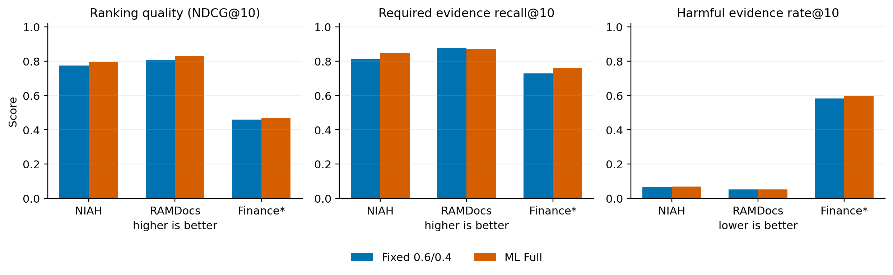
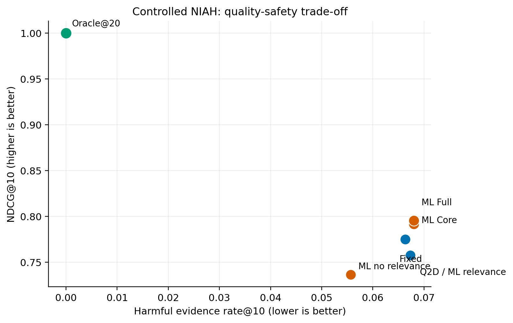
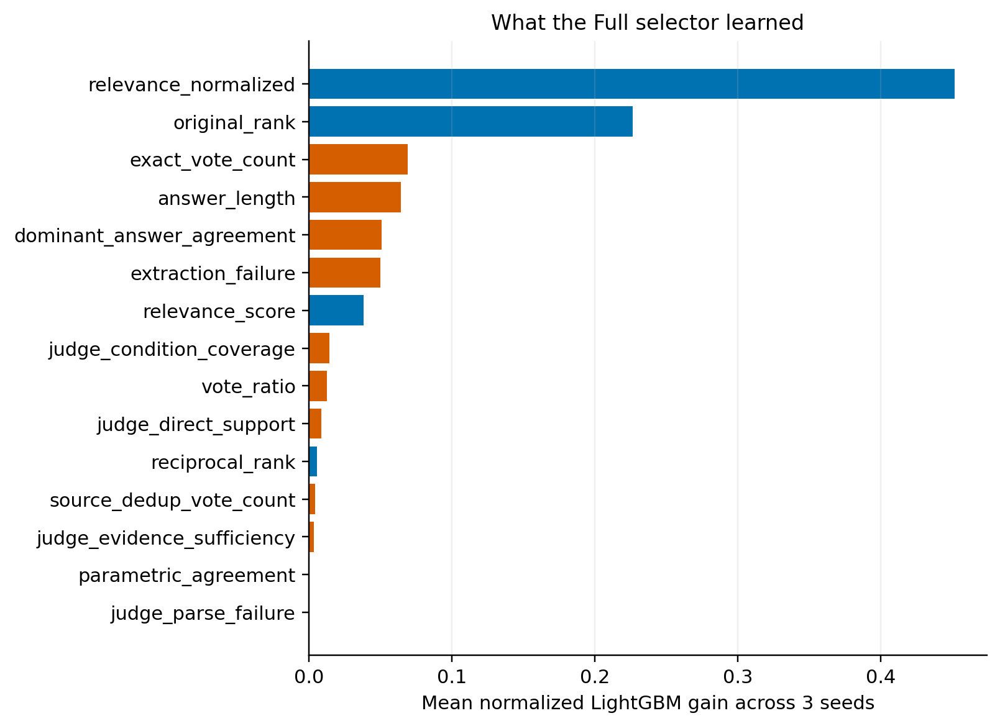

# ML Evidence Selector V1 实验记录

**状态：** 已完成；探索性诊断，不是最终 benchmark 结果

**执行分支：** `week5_MLSelector`

**实验日期：** 2026-07-10 前后

**后续版本：** [V2 实验计划](V2_EXPERIMENT_PLAN.md)

> **结论边界：** V1 没有证明 ML selector 能稳定过滤 harmful 或 misleading evidence。FinanceBench 已在本轮使用，状态为 `EXPOSED_DIAGNOSTIC_ONLY`，不能再作为 V2 的未见最终评估集。

## 1. 为什么做 V1

已有的 corroboration reranker 在冻结的 NIAH n=300、nested 5-fold CV 上，把 `needle-found@10` 从 Query2Doc 的 57.0% 提高到 60.7%（+3.7 pp，p≈0.037），但 MRR 基本不变（0.304→0.303，p≈0.94）。这个结果提示收益发生在 Top-10 context-window 边界，而不是整体排名全面改善。

V1 进一步询问：在同一 Top-20 候选池和 Top-10 上下文预算下，学习式 selector 能否结合相关性、corroboration、support、condition 和 source 信号，在保留 required evidence 的同时减少 harmful evidence。

## 2. 实际系统和公平条件

所有方法共用同一接口：

```text
Query2Doc + Granite dense
→ 固定 Top-20 candidate IDs、原始分数和抽取缓存
→ selector 只重排前 20 条
→ 固定 Top-10 context budget
```

主要比较包括 `q2d`、固定 `alpha=0.6`、开发集选择的 `alpha*`、Logistic、`ml_core`、`ml_full`、source-dedup、support-only、relevance-only、shuffled-label 和 Oracle@20。

Core 特征包括 relevance、原始 rank、reciprocal rank、答案投票和 extraction failure。Full 进一步加入 source-dedup vote、dominant answer agreement、answer length，以及 Granite judge 的 direct support、condition coverage 和 evidence sufficiency。主模型使用三个随机种子 `13/42/73`。

## 3. 数据、划分和标签

| 数据 | V1 中的用途 | 规模/划分 | V1 后状态 |
|---|---|---|---|
| NIAH | 受控训练、开发和测试 | train 500 / dev 300 / test 300；按父页面与 synthetic family 隔离 | 诊断数据，可用于理解 V1 |
| RAMDocs | 外部冲突/噪声方向检查 | official pool Top-3；adapted 500×Top-20→10 | 外部诊断 |
| FinanceBench | 财报领域诊断 | 全部 150 问题；company-aware 处理 | `EXPOSED_DIAGNOSTIC_ONLY` |
| ContractNLI | 合同 evidence 定位与迁移诊断 | official train/dev/test；同合同不跨 split | 关系建模数据来源之一 |

候选保存五级 `utility_grade`：4 为直接完整支持，3 为必要的部分/互补证据，2 为真实但不足以回答，1 为一般噪声，0 为可能诱导错误答案的 harmful evidence。另存 direct/required support、harm type、来源和 provenance 等字段。

自动审计显示 NIAH Top-20 候选池覆盖 1,100 个 query、22,000 条候选，required-evidence recall@pool 为 0.944。人工双标没有完成；模型辅助标签审计中 canonical label 与两个 Granite prompt 的 quadratic weighted kappa 仅为 0.0805 和 0.0050，说明标签语义仍需重新设计或独立验证。

## 4. 已完成的工作

| 阶段 | 实际完成内容 | 主要共享证据 |
|---|---|---|
| M0 协议 | 冻结五级 utility、Top-20→10、公平条件、指标和 Gates | [`protocol_manifest.json`](../../data/selector/protocol_manifest.json) |
| M1 数据 | 固定 NIAH 父页面 split、ContractNLI official split、FinanceBench company grouping 和 RAMDocs 协议 | [`split_manifest.json`](../../data/selector/split_manifest.json) |
| M2 标签 | 确定性标签映射和 80 组模型辅助审计；人工双标未完成 | [`label_audit_summary.json`](../data/ml_selector_validation/pilot/label_audit_summary.json) |
| M3 候选/特征 | 固定候选池、hash 审计、QA 投票和 Granite reliability 特征 | [`docs/data/ml_selector_validation/`](../data/ml_selector_validation/) |
| M4 基线 | q2d、fixed、alpha*、source-dedup、support-only、Oracle@20 | 各数据集 `results.json` |
| M5–M6 模型 | Logistic、Core、Full，3 seeds；shuffled-label 负控和消融 | [NIAH 结果](../data/ml_selector_validation/pilot/results.json) |
| M7 诊断 | NIAH、RAMDocs、FinanceBench、ContractNLI；feature importance | [精简证据目录](../data/ml_selector_validation/) |
| M8 RAG | Gate 1 失败后未运行完整 V1 RAG | 按协议停止 |
| M9 接入 | 未注册生产 retriever arm | 避免把未通过方法并入主线 |

主要实现入口：

- 数据与 schema：[`selector_data.py`](../../src/retrieval/selector_data.py)、[`selector_schema.py`](../../src/retrieval/selector_schema.py)
- NIAH V1：[`prepare_niah_selector_split.py`](../../eval/prepare_niah_selector_split.py)、[`niah_selector_pilot.py`](../../eval/niah_selector_pilot.py)、[`audit_niah_selector_pilot.py`](../../eval/audit_niah_selector_pilot.py)
- 外部诊断：[`ramdocs_selector.py`](../../eval/ramdocs_selector.py)、[`financebench_selector.py`](../../eval/financebench_selector.py)、[`contractnli_selector.py`](../../eval/contractnli_selector.py)、[`external_selector_eval.py`](../../eval/external_selector_eval.py)
- 汇总与绘图：[`summarize_selector_models.py`](../../eval/summarize_selector_models.py)、[`plot_selector_results.py`](../../eval/plot_selector_results.py)

## 5. Gate 结果

| Gate | 要求 | V1 状态 | 解释 |
|---|---|---|---|
| Gate 0 | 无 leakage；人工 weighted kappa ≥0.70 | **未完成** | 自动检查通过；人工双标未完成；模型辅助审计一致性很低 |
| Gate 1 | sealed NIAH：NDCG +0.02、harmful -0.02、recall 非劣 | **FAIL** | NDCG +0.0206、recall +0.0368，但 harmful reduction 为 -0.0017，即 harmful rate 略升 |
| Gate 2 | 至少两个外部域正向且 recall 非劣 | **FAIL** | RAMDocs 只有部分排序信号；FinanceBench 无显著改善；ContractNLI 迁移失败 |
| Gate 3 | 至少两个答案主指标改善 | **NOT RUN** | 按 Gate 1 停止规则未运行完整 V1 RAG |

## 6. 结果反映了什么

### 6.1 NIAH：排序和 recall 提高，不等于过滤 harmful evidence

在 V1 test 上，`ml_full` 相对 fixed 0.6：

| 指标 | fixed 0.6 | ml_full | 配对变化 |
|---|---:|---:|---:|
| NDCG@10 | 0.7750 | 0.7955 | +0.0206，95% CI [0.0105, 0.0308] |
| Required evidence recall@10 | 0.8118 | 0.8486 | +0.0368，95% CI [0.0168, 0.0588] |
| Harmful rate@10 | 0.0663 | 0.0680 | reduction = -0.0017，p=0.1532 |

因此 V1 支持“学习式重排能让更多 required evidence 进入 Top-10”的诊断性信号，但不支持“selector 已学会过滤 harmful evidence”。

### 6.2 特征仍被 relevance/rank 主导

Full 模型的 mean normalized gain 中，`relevance_normalized` 为 0.452，`original_rank` 为 0.227；三个 judge 特征合计贡献很小。去掉 relevance 后 harmful rate 会下降，但 NDCG 和 required recall 同时明显下降。这说明简单地压低疑似风险证据会损失有用证据，V2 需要显式关系结构而不是仅加几个独立 judge 分数。

### 6.3 外部诊断没有形成稳定泛化

- RAMDocs adapted Top-20→10 上，Full 相对 fixed 的 NDCG +0.0235，但 harmful reduction 为 -0.0006、required recall -0.0037；方向不完整。
- FinanceBench 上 Full 相对 fixed 的 NDCG -0.0178、harmful reduction -0.0107，均未支持正向结论。该数据又已被提前查看，不能继续承担最终盲测。
- ContractNLI 上 Full 相对 fixed 的 NDCG -0.1336、required recall -0.0870，显示 NIAH 训练的 selector 不能直接跨域迁移。

## 7. V1 不能声称什么

- 不能声称 ML selector 已经过滤 misleading、conflicting 或 harmful evidence。
- 不能把 FinanceBench 数字作为 V2 的独立最终 benchmark。
- 不能声称结果全面改善排序或稳定提升 rank 1；此前 corroboration 的 MRR 是平的。
- 不能把模型辅助标签审计称为人工 inter-annotator agreement。
- 不能把未运行的 V1 RAG 结果或未接入的生产 retriever 描述为已完成。

## 8. 结果与中间产物的保存决定

Git 保留小型、可核验的 [`docs/data/ml_selector_validation/`](../data/ml_selector_validation/) 结果和审计 JSON，以及三张结果图：







完整 V1 输出原位于私有主机 `it097952`：

```text
/scratch/fl25387/IBM_Granite_Project/results/ml_selector/
```

总大小约 986 MB，其中 pilot 679 MB、FinanceBench 142 MB、ContractNLI 125 MB、RAMDocs 39 MB。主要大文件是 base/generated/validated pools、feature cache、ranked Top-20 JSONL、shards 和日志。它们没有整体迁移，因为 V1 不是最终方案、可以从代码重建，而且接手人无权访问该服务器。V2 不得把这些私有文件作为输入依赖。

## 9. 带入 V2 的设计教训

1. 把“Top-10 availability”与“harmful filtering”作为不同主张和不同 Gate。
2. 使用 `CLAIM_SUPPORTS`、`CLAIM_REFUTES`、`SAME_SOURCE` 显式建图，隔离 Graph 的贡献。
3. Relation Builder 和全套 Graph 特征必须 OOF，避免 gold 或同族泄漏。
4. 加入 NLI-without-Graph、Graph-only 和 shuffled-Graph 负控。
5. 训练、开发、最终评估在查看结果前冻结；FinanceBench 永久标为已暴露诊断集。
6. 每次运行同时保存精简结果包和 Tracker 记录，不让服务器路径成为唯一证据。
