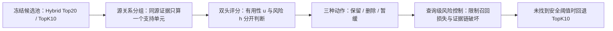

# Selector 风险控制执行计划（v1）

**冻结日期：** 2026-08-11

**状态：** 待执行（所有新实验结果均为 `TODO`，本文不预填结果）

**固定入口：** `refine-logs/EXPERIMENT_PLAN.md`

**实验跟踪：** `refine-logs/EXPERIMENT_TRACKER.md`

**当前生产基线：** Hybrid RRF Top20 → 按冻结排序保留 Top10

**候选方法名：** Source-aware Risk-Controlled Dual-Head Selector（源关系感知、风险受控的双头 Selector）

---

## 0. 一页结论

过去的 Beam、MIS 和 gated selector 都反复出现同一个问题：**删除错误证据的同时，也删除了大量正确证据**。这不是再调一次阈值就能可靠解决的问题，主要原因是：

1. 旧模型把“无用”和“有害”合并成删除信号，但一条证据可以同时“与问题高度相关”又“内容错误”；
2. 三分类 softmax 迫使“有用”和“有害”互相竞争，不能表达“高价值但高风险”；
3. 逐条做删除决定，没有先判断多跳证据链是否仍然完整；
4. 固定阈值只控制单条分数，不控制每个问题最终丢失多少正确证据；
5. 同一来源的多个页面、区域、OCR 或摘要可能被错误地当成多份独立支持。

因此，下一版不再直接训练一个“删/留分类器”，而拆成四层：

核心原则是：**先证明“这一档删除强度不会超过允许的召回风险”，再允许它删除。** 如果校准数据上找不到满足约束的删除强度，系统必须输出原始 TopK10；“不删除”是合法且预先规定的结果，不属于实验失败后临时修改规则。

本计划只承诺检验两项主张：

- **C1（主要主张）：** 在冻结的 Top20 候选池与 TopK10 基线下，风险控制双头 Selector 能使 NIAH 条件性有害证据暴露率至少下降 3 个百分点，同时 NIAH 与 2Wiki 的 required/supporting recall 各自损失不超过 3 个百分点，并限制完整多跳证据链的破坏。
- **C2（机制主张）：** 在相同评分器、相同删除预算和相同风险约束下，源关系分组能减少“同源证据被当成独立 corroboration”的错误，并改善 harmful-recall 前沿；提升不能仅由“最终文档更少”解释。

如果 C1 不成立，新的 Selector 不进入生产，TopK10 保持不变。如果 C1 成立但 C2 不成立，可以保留风险控制层作为工程改进，但不能把“源关系建模有效”写成论文贡献。

---

## 1. 已知事实：过去到底失败在哪里

### 1.1 冻结结果

| 实验 | 有害证据变化 | 正确证据变化 | 结论 |
|---|---:|---:|---|
| Beam M2 最佳召回配置（required=0.4, reject=0.9） | NIAH 88.13% → 11.64%，下降 76.49 pp | NIAH recall 81.51% → 64.21%，下降 17.30 pp | 删除很强，但正确证据损失不可接受 |
| Beam M2 全部 16 组阈值 | 下降 76.11–81.48 pp | 下降 17.30–20.08 pp | 没有任何合格配置；继续调阈值意义很低 |
| MIS formal | 91.77% → 31.35%，下降 60.42 pp | 90.97% → 53.80%，下降 37.17 pp | 更严重地破坏正确证据，多跳任务也下降 |
| 早期 gated selector | 下降约 11.2 pp | 下降约 4.8 pp | 接近但仍越过召回红线；且旧划分存在重叠问题 |

详细来源：

- [`docs/selector/SELECTOR_BALANCE_REVIEW_2026-08-10.md`](../docs/selector/SELECTOR_BALANCE_REVIEW_2026-08-10.md)
- [`docs/selector/SELECTOR_FINAL_REPORT.md`](../docs/selector/SELECTOR_FINAL_REPORT.md)

### 1.2 不能再重复的错误

1. **标签结构错误。** harmful 与 irrelevant 被合并为删除信号；“错误但相关”的证据容易被模型理解为 relevant，从而产生互相冲突的监督。
2. **决策粒度错误。** 单文档分数不能保证问题级 required recall，更不能保证所有多跳支撑文档仍完整。
3. **长度偏置。** Beam 路径分数没有充分处理长度和显式 STOP，容易偏爱更短的证据集合。
4. **训练—推理不一致。** 训练只见 gold trajectory，推理却沿模型自己生成的路径前进，错误会累积。
5. **输入截断。** query + 已选证据 + candidate 受 512 token 限制，后部信息可能被不稳定截断。
6. **负例可能不干净。** 2Wiki 中 Top20 内未标注证据曾被当成 irrelevant，可能包含未穷举的有效证据。
7. **评测混杂。** 旧实验缺少 TopK5 和逐问题 count-matched random deletion，对“算法更聪明”与“只是删得更多”区分不足。
8. **统计记录不完整。** 部分报告只有汇总结果，缺原始逐问题预测；Monte Carlo `p=0.0` 的写法也需要修为 plus-one 估计或 `p < 1e-4`。
9. **适用范围被夸大风险。** NIAH harmful 是确定性合成 counterfactual；它能衡量受控环境中的删除能力，不能单独证明对现实错误信息的真实性判断能力。

---

## 2. 文献如何转化为本项目的方法

### 2.1 Conformal Risk Control：把“希望少误删”变成明确风险约束

**参考：** [Conformal Risk Control, ICLR 2024](https://proceedings.iclr.cc/paper_files/paper/2024/file/f3549ef9b5ff520a7e41ff3cc306ab2b-Paper-Conference.pdf)

它给本项目最重要的启发不是一个新分类器，而是一个**包在分类器外面的安全层**：先在独立 calibration 集上观察不同删除强度造成的真实损失，然后只采用满足预先规定风险上限的强度。

本项目采用两个查询级损失：

\[
L_{rec}(q,\lambda)=\max\{0,\operatorname{Recall}(S_0(q),G_q)-\operatorname{Recall}(S_\lambda(q),G_q)\}
\]

\[
L_{chain}(q,\lambda)=\mathbb{1}[G_q\subseteq S_0(q)\ \land\ G_q\nsubseteq S_\lambda(q)]
\]

其中 `S0` 是 TopK10，`Sλ` 是候选删除强度 `λ` 下的结果，`Gq` 是 required/supporting gold evidence。第一个损失回答“少保留了多少正确证据”，第二个回答“原本完整的证据链是否被删断”。

**边界：** conformal/CRC 不知道哪条内容是真的，它只能在“校准分布与未来分布足够相似”的前提下控制已定义损失。因此必须保留独立 calibration，不能用 decision-dev 或 sealed test 反复选阈值。

### 2.2 Principled Context Engineering：说明 conformal 可以用于 RAG 证据过滤

**参考：** [Principled Context Engineering for RAG, arXiv:2511.17908 / ECIR 2026](https://arxiv.org/abs/2511.17908)

这项工作表明可以对 RAG 上下文做 conformal filtering。直接可借鉴的是“先给候选片段打分，再用校准选择保留集合”。但它主要关注单片段的边际覆盖，不能直接保证本项目最关心的多跳证据链完整性。因此我们保留它的校准思想，同时把风险定义提升到**整个 query**。

### 2.3 Provence：借用强的 token/片段级有用性评分，不照搬它的删除规则

**参考：** [Provence, ICLR 2025](https://proceedings.iclr.cc/paper_files/paper/2025/file/5e956fef0946dc1e39760f94b78045fe-Paper-Conference.pdf)

Provence 说明 DeBERTa 类模型可以高效识别应该保留的上下文片段。它适合作为：

- 一个权威的外部 scorer/pruner 基线；
- utility head 的结构参考；
- 检查“旧 Beam 失败究竟来自评分器，还是来自决策层”的对照。

但 Provence 不负责判断 counterfactual 是否真实有害，也没有本项目要求的 query-level recall/chain 风险保证，所以不能直接替代新方案。

### 2.4 SetR 与 Beam Retrieval：正确证据不是互相独立的十个点，而是一个集合/链

**参考：** [SetR, ACL 2025](https://aclanthology.org/2025.acl-long.861/)、[Beam Retrieval, NAACL 2024](https://aclanthology.org/2024.naacl-long.96/)

这两类工作提示：多跳任务的目标不是单条相关性最高，而是证据集合是否足以完成推理。由此得到两项设计：

- 主评测必须加入 `complete-chain survival`，不能只看平均 recall；
- utility 评分可以考虑当前已保留集合 `S`，但第一阶段不得重新引入无约束 Beam 搜索，以免再次产生长度偏置和 exposure bias。

### 2.5 NEST：先守召回，再优化精度

**参考：** [NEST, ACL Industry 2026](https://aclanthology.org/2026.acl-industry.35/)

它强化了本计划的顺序：先冻结 recall-first 的候选集合，再在明确预算内改善 precision。新 Selector 第一版只从 TopK10 内做有限删除，不从 rank 11–20 动态补位；补位会把“删除”和“二次检索”混在一起，留到 C1 成立后再研究。

### 2.6 RA-RAG：来源可靠性是辅助信号，不是真值标签

**参考：** [RA-RAG, EMNLP 2025](https://aclanthology.org/2025.emnlp-main.1738/)

来源关系可以帮助判断多条证据是否真正独立，但“多数来源一致”也可能共同引用同一个错误上游。因此本项目只把 source group 用于：去重独立支持数、识别同源冲突和调整置信度；不把网站或文档来源直接当成真/假标签。

---

## 3. 新 Selector 的最小可行定义

### 3.1 输入保持冻结

- 检索器和融合器不变：Hybrid RRF Top20。
- 主基线不变：按冻结 rank 取 Top10。
- 第一版 Selector 的候选操作只限 TopK10 内：`KEEP / DROP_HARM / DEFER`。
- 不允许用 rank 11–20 自动替换被删文档；这是后续独立研究问题。

### 3.2 双头而不是三分类

对候选证据 `d` 计算两个不互相排斥的分数：

- `u(q,d,S)`：有用性/必要性。回答“删掉它会不会损害回答或多跳证据链？”
- `h(q,d,g)`：有害风险。回答“它是否像受控 counterfactual、明显矛盾或低可靠证据？”其中 `g` 为 source group。

动作规则：

| utility | harm | 动作 | 原因 |
|---|---|---|---|
| 高 | 低 | `KEEP/PROTECT` | 很可能是必要证据 |
| 低 | 高 | `DROP_HARM` | 最安全的删除区域 |
| 高 | 高 | `DEFER` | “相关但可能错误”，不可自动删除 |
| 低 | 低 | `KEEP` 或受预算的压缩 | 不是本阶段的主要矛盾 |

`DEFER` 在本实验里默认等价于“保留但附风险标记”。只有未来接入生成器后，才可触发查证、拒答或追加检索。

### 3.3 标签与损失必须允许“一条证据同时有用又有害”

每个 candidate 使用两个彼此独立的标签和 loss mask，不再把它塞进互斥的三分类：

- `y_u=1`：官方 required/supporting qrel；
- `y_h=1`：有可验证 clean-counterfactual 映射的合成 harmful；
- counterfactual 若来自回答问题所需的事实位置，可以同时取 `y_u=1, y_h=1`；
- unjudged 不自动等于 negative。2Wiki 未标注 Top20 默认 mask 掉 negative loss，只有明确构造并通过审计的负例才作为 `y_u=0`；
- harm negative 优先使用与 counterfactual 成对的 clean counterpart，避免让来源、长度或 frozen rank 成为伪捷径；
- 两个 head 分别报告 calibration，不能用一个 head 的高分抵消另一个 head。

这一步直接修复旧 Beam 最关键的监督冲突：模型不再被迫在“相关”和“错误”之间二选一。

### 3.4 来源分组先于投票

优先构建以下来源链：

`document → page → region → OCR/caption/parser view`

规则：

1. 同一 source group 的多个视图在 corroboration 计数中最多算一票；
2. 同源文本冲突优先视为抽取/解析不确定性；
3. 独立来源冲突触发 `DEFER`，不自动把少数方删除；
4. 缺少 source id 时使用保守策略：不宣称独立，不用来源数量提高删除置信度。

### 3.5 查询级删除预算与安全回退

第一轮只比较每个 query 最多删除 `b ∈ {0,1,2,3}` 条。候选规则形成嵌套集合，删除强度增大时集合只能变小，以满足 CRC 的可校准性。

- 校准后若只有 `b=0` 满足风险约束，输出 TopK10；
- 不允许为了达到有害证据指标而临时放宽 recall 上限；
- 不允许在 decision-dev 或 sealed test 上重新选择阈值。

---

## 4. 数据角色与防泄漏协议

### 4.1 冻结数据

| 数据 | 已知规模/状态 | 新计划角色 |
|---|---|---|
| NIAH train assignments | 1,023 | 90% train-fit；10% train-modelval，按组拆分 |
| 2Wiki train | 3,000 | 90% train-fit；10% train-modelval，按 query 拆分 |
| NIAH dev assignments | 1,479 | 50% CRC-calibration；50% decision-dev，按组拆分 |
| 2Wiki dev | 2,000 | 50% CRC-calibration；50% decision-dev |
| NIAH sealed600 | 600 | 只在 M5 一次性正式评测 |
| 2Wiki heldout | 2,000 | 只在 M5 一次性正式评测 |

`train-modelval` 只选 scorer/checkpoint；`CRC-calibration` 只选安全删除强度；`decision-dev` 只做开发阶段 go/no-go；`sealed/heldout` 只做最后一次确认。四种角色不得互换。

### 4.2 分组拆分

- NIAH 使用 `query_id + source_parent_id + synthetic_family` 组成 group key；同组不可跨 split。
- 2Wiki 至少按 `query_id` 拆分；若存在 source parent 信息，也纳入 group key。
- 用冻结的 SHA-256 哈希映射完成确定性拆分；M0 记录确切条数、group 数量和 manifest hash。
- 运行重叠审计：query、source parent、synthetic family 三个层次都报告交集。
- 历史早期 S1–S6 结果不得被描述成通过了新拆分协议；只作背景证据。

### 4.3 harmful 指标的正确表述

NIAH 的 harmful 是合成 counterfactual，并且旧指标常在“有害文档进入候选池”的条件下计算。新报告必须同时给出：

- conditional harmful exposure（分母为 harmful pool-hit query）；
- unconditional harmful exposure（分母为全部 query）；
- pool-hit rate 与确切分子/分母；
- 95% paired bootstrap CI。

任何报告不得把 synthetic harmful reduction 直接写成“现实错误信息准确率”。

---

## 5. 核心实验块（最多五块）

### B1. 完整性与基线复现（MUST，主文方法可信度）

**问题：** 新结果是否建立在相同候选池、相同样本和可复算指标上？

**实验：**

1. 重算 TopK10 在所有开发角色上的 recall、precision、harmful exposure 和 chain survival；
2. 加入 TopK5；
3. 对每个候选方法的实际保留数量，运行逐 query count-matched random deletion；
4. 验证每条预测都有 `query_id / candidate_id / frozen_rank / label / source_group / u / h / action`；
5. 修复 permutation/Monte Carlo p-value：使用 `(extreme+1)/(iterations+1)`，小于分辨率时写成上界，不写 `p=0.0`。

**通过门槛 G1：**

- 冻结 TopK10 指标可与已归档报告在舍入误差内一致；
- split 重叠为 0；
- 所有分母可追溯；
- 随机基线按最终保留数量匹配；
- 逐问题预测和配置 hash 完整保存。

未通过则停止，不训练新模型。

### B2. Scorer 可分性诊断（MUST，决定问题是否可学）

**问题：** 模型是否真的能把“必要”和“有害”分开，还是任何决策层都会重演旧问题？

**比较：**

1. RRF rank/score（无训练基线）；
2. 官方 Provence checkpoint（强 utility scorer/pruner 基线）；
3. 新 dual-head DeBERTa：utility 与 harm 分开输出；
4. 历史 Beam scorer 仅在 checkpoint 和逐问题映射可恢复时作诊断，不把汇总数字伪装成可复现实验。

**只在 train-modelval 上观察：** PR-AUC、ROC-AUC、Brier score、ECE、required/harmful 二维散点、按 frozen rank 与 hop 分层的混淆矩阵、截断率。

**通过门槛 G2：** 在 train-modelval 上至少存在一个预设删除预算/分数区域，达到：

- NIAH conditional harmful exposure 至少下降 3 pp；
- NIAH required recall 损失不超过 5 pp；
- 2Wiki supporting recall 损失不超过 5 pp。

这里 5 pp 只是“是否值得进入风险校准”的宽松门槛，不是最终验收线。如果不存在这样的区域，停止 truth-filtering 路线，保留 TopK10，并把风险交给生成端 `DEFER/abstain`。

### B3. 查询级风险控制主实验（MUST，C1 主结果）

**固定 scorer 后比较决策层：**

1. 固定阈值；
2. 固定删除预算 `b=1/2/3`；
3. 片段级 marginal conformal filtering；
4. 本方法：query-level CRC，同时约束 `L_rec` 与 `L_chain`。

CRC 的候选阈值只在 calibration 上选择。分别控制 NIAH recall、NIAH chain、2Wiki recall、2Wiki chain；置信水平与多重风险修正预先冻结，默认总 `δ=0.05`，四项采用 Bonferroni 分配。若理论实现采用等价且更紧的多风险控制，必须在看 decision-dev 之前写入配置和说明。

**通过门槛 G3（decision-dev，seed 13）：**

- NIAH harmful exposure 下降 ≥3 pp，且配对 95% CI 上界 `< 0`；
- NIAH required recall 点估计损失 ≤3 pp；
- 2Wiki supporting recall 点估计损失 ≤3 pp；
- 两个数据集 recall 差值的 95% CI 下界均不低于 `−5 pp`；
- complete-chain failure 点估计 ≤3%，95% CI 上界 ≤5%；
- 在相同每 query 保留数量下，优于 count-matched random deletion；
- 不允许用两个数据集的平均值掩盖其中一个失败。

任一项失败：不进入三种子与 sealed test。

### B4. 来源关系贡献隔离（MUST-PAPER；C2 主结果）

**问题：** source grouping 是否真的提供新信息，而不是换一种写法的去重？

在相同 scorer、CRC 参数族和删除预算下比较：

1. flat：每条片段都当独立来源；
2. exact/near-duplicate dedup：只做文本去重；
3. source-group：按 document/page/region/view 建模；
4. source-group 去掉同源冲突规则（机制消融）。

**现有数据部分：** 使用已有 source parent 字段测试 recall/harmful 前沿与无回归。

**现实来源部分：** 建立小型 source-dependent multi-view benchmark。先做 100 个平衡案例的双人独立标注与仲裁，估计 prevalence 和一致性，再在不看模型结果的前提下做功效分析并冻结正式样本量。随后完成该冻结样本量的正式双标、仲裁和盲评；pilot 只用于设计标注协议，不与正式效果数字混合。

新增指标：

- false corroboration rate：同一上游来源的多个视图被错误计为多份独立支持的比例；
- independent-source count error；
- same-source conflict defer recall；
- risk-coverage curve。

**通过门槛 G4-source：** source-group 相比 flat 和纯文本 dedup，false corroboration rate 显著下降，且不违反 G3 的 recall/chain 红线。若只去重就获得相同效果，则 C2 不成立，论文不得宣称来源关系建模的独立贡献。

### B5. 多种子与一次性正式确认（MUST，C1/C2 最终证据）

只有 B1–B4 的开发门槛通过后运行：

- 固定种子 `[13, 42, 73]`；
- 冻结模型、checkpoint 选择规则、CRC 参数族和 source grouping；
- 在 decision-dev 上报告三种子均值、标准差及每个种子的最差值；
- 最后一次性解封 NIAH sealed600 与 2Wiki heldout。

**多种子门槛：**

- 两数据集平均 recall 损失均 ≤3 pp，且任何种子不得超过 5 pp；
- 平均 harmful reduction ≥3 pp，且每个种子的方向都必须是下降；
- chain failure 平均 ≤3%，任何种子不得超过 5%；
- 所有 count-matched 对照、分母和 CI 同时报告。

**正式门槛 G5：** sealed600 与 2Wiki heldout 分别满足 G3；不得在看到结果后回到 calibration 调阈值。正式门槛失败时，记录失败并保留 TopK10，不开启第二次“正式测试”。

---

## 6. 三个基线家族

为避免实验爆炸，核心比较限制为三个家族：

| 家族 | 具体方法 | 要排除的替代解释 |
|---|---|---|
| 固定排序/数量 | TopK10、TopK5、count-matched random deletion | 提升是否仅因为文档更少 |
| 强评分器/压缩器 | Provence；可恢复时的历史 Beam scorer | 提升是否只是换了更强 encoder |
| 决策与风险控制 | fixed threshold、budget-only、marginal conformal、query-level CRC | 提升是否来自风险控制而非阈值运气 |

RECOMP、生成端 sufficient-context 判断和追加检索属于 appendix/nice-to-have；在 C1 通过前不进入核心矩阵。

---

## 7. 消融矩阵与优先级

| ID | 组件组合 | 优先级 | 对应主张 | 预期判别作用 |
|---|---|---|---|---|
| A0 | TopK10 | MUST | C1 | 不删除的主锚点 |
| A1 | TopK5 | MUST | C1 | 简单强删基线 |
| A2 | count-matched random | MUST | C1/C2 | 排除文档数量混杂 |
| A3 | dual-head + fixed threshold | MUST | C1 | 检验双头本身 |
| A4 | dual-head + marginal conformal | MUST | C1 | 检验 query-level 控制是否必要 |
| A5 | dual-head + query CRC | MUST | C1 | 核心方法 |
| A6 | A5 去掉 utility head | MUST | C1 | 检验保护正确证据是否依赖 utility |
| A7 | A5 去掉 harm head | MUST | C1 | 检验 harmful signal 是否真实贡献 |
| A8 | A5 + source group | MUST-PAPER | C2 | 完整方法 |
| A9 | A8 改为纯文本 dedup | MUST-PAPER | C2 | 区分来源结构与去重 |
| A10 | A8 去掉 same-source conflict defer | MUST-PAPER | C2 | 检验冲突机制 |
| A11 | A8 + set-sufficiency head | NICE | 后续 | 只在 A8 通过后尝试 |
| A12 | 删除后从 rank11–20 补位 | CUT-v1 | 后续 | 会混入二次检索变量 |

---

## 8. 统计与报告协议

### 8.1 主指标

- NIAH conditional/unconditional harmful exposure；
- NIAH required recall；
- 2Wiki supporting recall；
- complete-chain survival/failure；
- precision 与平均保留数量；
- source benchmark 的 false corroboration rate；
- risk-coverage curve。

### 8.2 比较方式

- 所有方法与 TopK10 做逐 query 配对比较；
- 比例差使用 paired bootstrap 95% CI；
- 随机删除至少使用 100 个冻结随机重复，报告重复间变异；
- Monte Carlo p-value 使用 plus-one 修正；
- 三种子同时展示，不能只报最优种子；
- 不把 NIAH 和 2Wiki 合并成一个平均分；
- 主张使用绝对百分点（pp），同时可附相对变化。

### 8.3 失败也必须保存

每次运行至少保存：

- 完整配置与配置 hash；
- Git commit、数据 manifest/hash、模型 revision；
- 逐 query、逐 candidate 预测；
- 聚合指标与 CI；
- 环境、耗时、峰值显存；
- stop-gate 判定和失败原因。

---

## 9. 分阶段执行顺序

### M0 — 协议与数据冻结（0 GPU）

**工作：** 实现新 split、重叠审计、指标定义、plus-one p-value、输出 schema、hash manifest。

**产物：** `results/selector-crc-dual-head-v1/m0_protocol/`

**退出条件：** G1 的完整性部分通过。

### M1 — 基线与数量混杂校正（0 GPU）

**工作：** TopK10、TopK5、count-matched random；重算历史可复现基线。

**产物：** `results/selector-crc-dual-head-v1/m1_baselines/`

**退出条件：** 所有分母与逐问题结果可追溯。

### M2 — Scorer 诊断（先小样本，再 seed 13）

**工作：** RRF、Provence、dual-head；先用 200 query 做速度/显存基准，再训练 seed 13。

**产物：** `results/selector-crc-dual-head-v1/m2_scorer/`

**退出条件：** G2 通过；否则终止 truth-filtering。

### M3 — CRC 与决策层（seed 13）

**工作：** fixed threshold、budget-only、marginal conformal、query CRC；只在 calibration 选参数，只在 decision-dev 判定。

**产物：** `results/selector-crc-dual-head-v1/m3_crc/`

**退出条件：** G3 全部通过。

### M4 — 来源关系与三种子

**工作：** flat/dedup/source-group 消融；完成 `[13,42,73]`；完成现实来源 100-case 标注 pilot、功效分析和冻结规模的正式盲评。

**产物：** `results/selector-crc-dual-head-v1/m4_source_and_seeds/`

**退出条件：** 多种子门槛通过；C2 按自身证据单独判定。

### M5 — 一次性正式评测

**工作：** 冻结后一次性运行 sealed600 与 2Wiki heldout。

**产物：** `results/selector-crc-dual-head-v1/m5_formal/`

**退出条件：** G5；通过才允许提出生产替换建议。

### M6 — 可选的生成端闭环

只在 M5 通过后，把 `DEFER` 接到查证/拒答/追加检索，评估端到端回答正确率与 citation precision/recall。M6 不得用于补救 M5 的 Selector 失败。

---

## 10. 预计成本与资源闸门

现有报告没有可靠记录一次完整 Beam/DeBERTa 训练的实际 GPU 小时，因此本计划不伪造绝对工时。M2 首先用 200 query 基准测量并把实测吞吐、峰值显存和预计总时长写入 tracker，然后才批准全量训练。

以“一个完整 dual-head seed 训练”为 1 个训练单位：

| 阶段 | 最大预算 | 超额处理 |
|---|---:|---|
| M0–M1 | 0 GPU | 可直接执行 |
| M2 scorer feasibility | ≤1 个训练单位 + scorer inference | G2 失败立即停止 |
| M3 decision/CRC | 不新增训练；复用 seed 13 | 不允许以重训掩盖决策层失败 |
| M4 三种子 | 新增 2 个训练单位 | 只有 G3 通过才批准 |
| M5 formal | 仅冻结模型推理 | 不允许再调参 |

核心开发上限为 3 个完整训练单位。任何额外模型结构、第五个种子或大规模人工标注都需单独立项。

---

## 11. 预先注册的停止条件

出现以下任一情况立即停止相应路线：

1. 数据角色交叉、source/query 泄漏或无法恢复逐问题映射；
2. G2 不存在“harm −3 pp、recall loss ≤5 pp”的可行区域；
3. CRC 只有在放宽到 recall loss >3 pp 时才能获得有害证据下降；此时输出 TopK10，不改红线；
4. decision-dev 任一数据集失败，不用另一数据集的提升抵消；
5. 提升不能胜过 count-matched random deletion；
6. 三种子中出现 recall loss >5 pp；
7. sealed/heldout 失败后不得重新调阈值并再次称为“正式测试”；
8. source grouping 与纯文本 dedup 无差异时，撤销 C2，不扩大主张；
9. 对现实来源缺少可靠 ground truth 时，只报告 `DEFER/uncertainty`，不声称识别了真伪。

---

## 12. 最先执行的三个 Run

### R001 — protocol-freeze

- **目的：** 冻结 split、数据 hash、指标和输出 schema。
- **依赖：** 无。
- **输出：** split manifest、overlap audit、metric unit tests、TopK10 可复算表。
- **决策：** 通过后才能运行任何新模型。

### R002 — count-matched-baselines

- **目的：** 建立 TopK10、TopK5、随机等量删除的真实参照。
- **依赖：** R001 PASS。
- **输出：** paired per-query table 与 95% CI。
- **决策：** 后续所有 Selector 都必须按自己的保留数量与其匹配。

### R003 — scorer-feasibility-200q

- **目的：** 在不做大规模训练前验证输入、标签、source group、截断和速度；比较 RRF/Provence/dual-head 初始化或小规模拟合。
- **依赖：** R001–R002 PASS。
- **输出：** 可分性图、PR-AUC/Brier/ECE、200-query harm-recall frontier、GPU 实测预算。
- **决策：** 若连宽松 G2 都没有可行迹象，不批准全量 seed 13。

---

## 13. 实现边界与建议文件

实验实现建议放在独立模块，并保持生产 TopK10 默认不变：

- `configs/selector/crc_dual_head_v1.toml`
- `src/evidence_rag/selector/dual_head.py`
- `src/evidence_rag/selector/source_grouping.py`
- `src/evidence_rag/selector/conformal_risk.py`
- `scripts/run_selector_crc_experiment.py`
- `tests/test_selector_crc_metrics.py`
- `results/selector-crc-dual-head-v1/<milestone>/<run_id>/`

在 M5 前不得把候选 Selector 注册为默认 production selector。若实验代码尚未实现，上述路径只是实施接口，不代表当前仓库已有这些文件。

---

## 14. 最终决策表

| 结果 | 工程决策 | 可写主张 |
|---|---|---|
| G2 失败 | 停止 Selector 自动删错；TopK10 + generator defer | 现有表示无法可靠分离 harmful 与 required |
| G2 过、G3 失败 | 保留 scorer 诊断，不上线 CRC | 单条可分但 query-level 安全边界不足 |
| G3/G5 过、C2 失败 | 可考虑风险控制 Selector；不宣称来源贡献 | CRC 改善安全前沿 |
| G3/G5 与 C2 均过 | 候选替换 TopK10，进入端到端验证 | 源关系感知的风险控制选择有效 |
| sealed/heldout 失败 | TopK10 保持生产默认 | 开发集效果未被正式确认 |

本计划的“把握”来自可证伪门槛和安全回退，不来自对论文结果的照搬。论文给出了合适的工具；是否适合本项目，必须由 R001–R013 的顺序证据决定。
