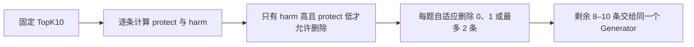

# Selector Lean v3：TopK10 内保守删除执行计划

**版本：** R005A/B amendment v3 Lean

**日期：** 2026-08-12

**状态：** `USER-APPROVED LEAN SCOPE / L000 PASS / FROZEN FOR IMPLEMENTATION / NOT RUN`

**上游事实：** R001–R004 `PASS`；旧 R005 永久保持 `FAIL`；R005A/B v1、v2 永久保持 `SUPERSEDED / NEVER RUN`

**生产默认：** TopK10，不修改

**本轮最终盲测：** R002 预先隔离的 NIAH/2Wiki `decision-dev`；模型、阈值规则、cap、代码和两个 checkpoint 冻结前不得查看新 Selector 效果。NIAH sealed600 与 2Wiki heldout 本轮不读取，留作后续外部确认。

> 这份 v3 取代的是尚未执行的 R005A/B v2，不改写任何旧结果。目标不再是建立一套复杂的实验发布系统，而是用最少且必要的步骤回答：Selector 能否比完全相同的 TopK10 略好一点，同时不误删正确证据。

---

## 1. 零基础先看：Selector 到底做什么

Retriever 已经给出 10 条证据。默认 TopK10 会把 10 条全部交给 Generator；Lean Selector 只在这 10 条里面做一次很保守的检查：



- `protect`：这条证据是否可能是回答问题所必需的；越高越应该保留。
- `harm`：这条证据是否像会误导答案的反事实/冲突证据；越高越危险。
- `safe_score = min(harm, 1 - protect)`：只有“危险分高”和“保护分低”同时成立，分数才会高。
- 每题可以一条都不删；不是强制删除。
- 最大删除数在开发集从 `1` 或 `2` 中选一个；因此不会被“最多只能删一条”卡死，也不会重演一次删掉大半证据的旧问题。
- 高 harm、高 protect 的冲突情况保留；缺分数、非法分数或依赖失败时整题保留。
- 不从第 11–20 名补位，Selector 输出永远是同题 TopK10 的子集。

一个简单例子：某题有 10 条证据，其中 1 条很像错误反事实、其余证据没有明确危险信号。Selector 只删掉那 1 条；如果没有任何一条达到严格门槛，就仍然输出原 TopK10。

### 前面的实验有没有白做

没有。v3 只替换失败的“判断器”，其余已验证资产继续使用：

| 历史阶段 | v3 保留什么 | 不再沿用什么 |
|---|---|---|
| R001 | 六套冻结候选池、身份与对齐证据 | 不重新检索 |
| R002 | component 分组、既有数据角色、成组 bootstrap | 不再运行 expected-risk CRC 策略层 |
| R003 | TopK10 主基线、TopK9/8/7结果、等量 random/bottom-rank 对照 | 不把“少给几条”当成 Selector 成功 |
| R004 | 标签和 mask 语义、输入边界、模型资源可行性 | 不改变未标注证据的含义 |
| R005 | 正式失败记录、16/16 配对方向与 AUC 诊断 | 不复用 raw-CLS checkpoint，不再围绕 0.5 调阈值 |

R003 已经说明固定 TopK9 虽让 harmful evidence 下降约 `2.04 pp`，却带来约 `1.90 pp` recall loss 和 `4.47 pp` chain loss。因此新实验必须证明“删对了”，不能只证明“删少了”。

---

## 2. 方法与论文启发

### 2.1 只保留两个研究主张

**C1（主张）：** 在完全相同的 TopK10 上，Lean Selector 能可信减少 NIAH 的 synthetic harmful evidence，同时让 NIAH required evidence、2Wiki supporting evidence 与完整多跳链基本不受损。

**C2（证据层支持主张）：** Selector 在证据层的选择性优于单纯缩短上下文；因此它必须优于逐题删除数量完全相同的 random 和 bottom-rank。该对照不重复运行 Generator，也不被扩大解释成下游答案改善的唯一原因。

最终回答指标是 C1 的下游验证，不另扩成第三套方法主张。

### 2.2 文献怎样落到当前方法

| 工作 | 给我们的启发 | v3 的具体采用方式 | 明确边界 |
|---|---|---|---|
| [Provence（ICLR 2025）](https://proceedings.iclr.cc/paper_files/paper/2025/file/5e956fef0946dc1e39760f94b78045fe-Paper-Conference.pdf) | 轻量 cross-encoder 能在生成前做动态 pruning | 恢复 DeBERTa 的预训练 NLI pooler/classifier 信息，再学习 protect/harm | relevance pruning 不等于真实世界事实核查 |
| [SetR（ACL 2025）](https://aclanthology.org/2025.acl-long.861/) 与 [Beam Retrieval（NAACL 2024）](https://aclanthology.org/2024.naacl-long.96/) | 多跳任务需要保护完整证据集合，不能只看单条局部分数 | required/supporting recall 与 conditional chain loss是硬保护指标 | 不重新引入大模型 CoT selector 或 beam 搜索 |
| [NEST（ACL Industry 2026）](https://aclanthology.org/2026.acl-industry.35/) | 先固定召回范围，再做精度选择 | 固定 TopK10，只做 delete-only，不扩检索范围 | 不声称提升 retriever recall |
| [Conformal Risk Control（ICLR 2024）](https://proceedings.iclr.cc/paper_files/paper/2024/file/f3549ef9b5ff520a7e41ff3cc306ab2b-Paper-Conference.pdf) | 校准数据和最终检验数据必须分开，失败时应回退 | 保留开发/最终盲测隔离与 P0；删除本轮不必要的 CRC 公式层 | v3 只称“经验验证的保守 Selector”，不声称 conformal guarantee |

### 2.3 真正修正的模型问题

旧 R005 实际使用：

```text
AutoModel → raw CLS → 两个随机 Linear(768,1)
```

这丢掉了冻结模型中已训练的 `ContextPooler + NLI 三分类 classifier`。v3 的主模型 `NLI-base` 改为：

```text
DeBERTa encoder
→ 预训练 ContextPooler
→ 一次共享 dropout
→ 两份互不共享参数的 NLI 三分类器
→ protect / harm 两个独立概率
```

- protect 使用 entailment 对其余两类的 one-vs-rest logit。
- harm 使用 contradiction 对其余两类的 one-vs-rest logit。
- 两个概率独立，不使用互斥 softmax；一条证据可以出现“既相关又有冲突风险”，此时动作层选择保留。
- 训练仍使用 R004 已核验的 masked BCE；未标注行不是负例。

`NLI-pair` 是唯一预注册后备：在 `NLI-base` 上增加 clean/counterfactual 配对损失，推动 `protect(clean)>protect(cf)`、`harm(cf)>harm(clean)`。权重固定为 `0.5`。只有两个 seed 的 `NLI-base` 在开发集找不到共同安全的非零删除策略时才运行它；两者都失败就停止，不继续堆模型。

旧 raw-CLS V0 不再必跑。旧 R005 已经记录它的正式失败；不运行新鲜 V0 的代价是我们不能声称“pooler 是旧失败的唯一原因”，但这不影响回答 Selector 是否有效。

---

## 3. 最小实验设计

### 3.1 数据只承担三个角色

| 角色 | 数据 | 用途 | 允许做什么 |
|---|---|---|---|
| 训练 | R002 `train-fit`：NIAH 920q/817 components；2Wiki 2700q/2094 components | 学 protect/harm | 训练两个固定 seed；不能决定最终结论 |
| 开发 | R002 `crc-calibration`：NIAH 740q/523 components；2Wiki 1000q/866 components | 选择 NLI-base 或 NLI-pair、safe-score 分位点和 cap | 只在这里选择一次方法与删除强度 |
| 最终盲测 | R002 `decision-dev`：NIAH 739q/534 components；2Wiki 1000q/866 components | 回答冻结 Selector 是否优于 TopK10 | 所有内容冻结后一次性运行；不得回头调参 |

`crc-calibration` 是历史文件名；v3 把它当普通 development split，不使用或声称 expected-risk CRC。`train-modelval` 完全不读取；代码与训练健康检查只使用 synthetic fixture、已暴露的旧 R005 样本和 train-fit。`decision-dev` 是本轮唯一最终盲测，L003 前不得产生或查看新 Selector 的分数、删除结果或效果指标。

数据隔离的准确说法：`crc-calibration` 与 `decision-dev` 的 query/component crossing 已冻结为 0；2Wiki train 与 official dev 仍有 449 个 supporting-parent overlap，不能宣传成所有 parent 全隔离。最终报告使用全部 `decision-dev` 为主结果，并按 `parent_seen_in_train_fit` 与 `unseen_in_any_used_data` 做敏感性分层；该标记只用于评测，不进入模型。NIAH sealed600 曾被旧 Reliability-MIS 路线使用过，不能再称为全项目 pristine blind，因此本轮不拿它冒充盲测。

### 3.2 固定训练与策略搜索

- 模型：`cross-encoder/nli-deberta-v3-base`，revision `6c749ce3425cd33b46d187e45b92bbf96ee12ec7`。
- 输入：只允许 `question + candidate_text`；rank、ID、role、component、provenance、label 不进入模型。
- 训练：seeds `13` 与 `42`；encoder、ContextPooler 与两只 classifier 全部共同微调。AdamW learning rate=`2e-5`、weight decay=`0.01`、betas=`(0.9,0.999)`、epsilon=`1e-8`，3 epochs，batch=`4`，gradient accumulation=`4`，无 scheduler、无 gradient clipping；其余运行环境写入普通 manifest。
- 监督：只训练 train-fit active-mask 行。class weight 按 `dataset × head × binary class` 的 inverse-square-root frequency 计算，并归一到每个 dataset/head 的 active-example mean weight=1；masked BCE 每只 head 按 active count 归一。未标注行不进入 loss。
- batch：R004 train-fit 当前有 NIAH active rows `5312`（其中 strict pairs `870`）和 2Wiki active rows `5311`。每 epoch 按 seed/epoch 的固定 hash 重排：先为每个 strict pair 建 870 个同批 microbatch，并依次填最多两个不属于 pair 的 NIAH active singleton；剩余 singleton 每4条一组，合计恰为 1328 个 NIAH microbatch。2Wiki 每4条一组也为 1328 个 microbatch。随后严格交替一个 NIAH、一个 2Wiki，得到 2656 个 microbatch/664 个 optimizer steps；不重复或漏掉 active row。若冻结输入复算不满足这些计数，训练前停止并修正数据身份，不能静默循环短源。该 1:1 指 microbatch 比例，不是按 query 数混合。

batch 顺序只用 UTF-8 字段计算，epoch 为 `1..3`，每项按 `(digest, query_id, evidence_id)` 升序：

```text
pair_digest = sha256(
  "selector-lean-v3\n" + seed + "\n" + epoch + "\nPAIR\n" +
  query_id + "\n" + clean_evidence_id + "\n" + cf_evidence_id)

row_digest = sha256(
  "selector-lean-v3\n" + seed + "\n" + epoch + "\n" + dataset + "\n" +
  query_id + "\n" + evidence_id)
```

严格 pair 按 `pair_digest` 排序；NIAH singleton与2Wiki row各按 `row_digest` 排序。依次给每个 pair 填下两个 NIAH singleton，再把剩余 singleton 连续每4条分组；2Wiki也连续每4条分组，最后严格 `NIAH_0,2Wiki_0,NIAH_1,2Wiki_1,...`。不使用文件枚举顺序。
- checkpoint：每个 seed 只保存最终 epoch。训练健康硬门只检查无 NaN/OOM、每个 step 的 active loss 为有限值、两个 head 的参数都相对初始化发生更新；epoch mean loss 仅作普通记录，不要求单调下降，也不作为是否接受 checkpoint 的额外门槛。新 checkpoint sidecar 必须记录 architecture version、NLI label map、base snapshot/config/checkpoint hash，不能冒充旧 raw-CLS fingerprint。
- 每个 seed 只生成一只全局阈值，不允许 NIAH/2Wiki 各用不同阈值。阈值池固定为该 seed 的全部 train-fit TopK10 float32 `safe_score`：按冻结 role assignment 的 query 顺序、每题 retrieval rank 排序，先拼 NIAH、再拼 2Wiki，保留全部原始行。nearest-rank 固定为升序第 `ceil(pN)` 个值，动作使用 `safe_score >= threshold`；重复数值保留各自 grid identity。四个分位点为 `99.5% / 99% / 97.5% / 95%`。
- 开发集只比较上述 4 个分位点 × cap `{1,2}`，外加 P0。没有任意阈值反复试探。

`NLI-pair` 的唯一目标也同时冻结。只对 train-fit NIAH 中同题、唯一一条 verified clean `(protect=1,harm=0)` 与唯一一条 counterfactual `(protect=0,harm=1)` 的严格 pair 计算：

```text
pair_mean = mean over eligible pairs in the current microbatch of
  0.5 * [
    softplus(-(protect_logit(clean)-protect_logit(cf)))
    + softplus(-(harm_logit(cf)-harm_logit(clean)))
  ]

total_loss = masked_dual_head_BCE + 0.5 * pair_mean
```

每个严格 pair 每 epoch 恰出现一次、两条 row 必须在同一 microbatch 和同一次 forward；最多再放两个 singleton。其余 active NIAH row 只做 BCE，2Wiki 只做 protect BCE；无 pair 的 microbatch 的 pair contribution 是 graph-connected exact zero。缺失、重复或歧义 row 不伪造 pair。`NLI-base` 使用完全相同的 pair-preserving batch，只把 pair weight 设为 0。

选择顺序：

1. 先训练 `NLI-base` 的 seed13 与 seed42。
2. 对每个候选分位点/cap，两个 seed 必须共同满足开发保护门；计算该候选两个 seed 的 NIAH harmful reduction 算术平均值。
3. 找到全局最大平均值，把与它相差 `≤0.5 pp` 的全部合格候选组成等价集；只在该等价集中依次选更高分位点、更小 cap、两个 seed平均删除更少者。
4. 若 `NLI-base` 没有合格非零策略，才以完全相同规则训练并评估 `NLI-pair` 两个 seed。
5. 若 `NLI-pair` 仍没有合格策略，停止；TopK10 保持默认，最终盲测不运行。

开发保护门：

- 确实删除过证据，但不要求每题都删；
- 两个 seed 的 NIAH harmful reduction 点值都 `>0`；
- 主 checkpoint seed13 的 NIAH required、2Wiki supporting 和两数据 conditional-chain loss 点值各自 `≤1 pp`；
- seed42 的上述任一保护损失点值不得 `>3 pp`；
- 对 seed13，按其每题真实删除数生成 100 次 random 与一次 bottom-rank；NIAH deletion precision 与 harmful reduction 必须分别大于 random-100 mean 和 bottom-rank point。seed42只承担正方向与保护复现，不增加第二套 control gate。

### 3.3 最终盲测与置信区间

最终前一次冻结：variant、两个 checkpoint、分位点、cap、代码 commit、输入池、evaluation projection 和 Generator 配置。development/final 的训练标签不能直接复用 R004 train-only label 文件；Lean evaluator 必须在 L001 先冻结一个小型只读 projection：development/final 按 R002 role/component 映射筛 query，再从 R001 已 pin 的 official gold、NIAH assignment/provenance 与 source-parent 按 R004 同一语义重建 required/harm/supporting 评测字段。L002 只物化并 hash development projection；L003 才物化并 hash `decision-dev` projection。它不修改旧 R002/R004，也不另建 materializer 或状态机。

最终同一批题同时运行 TopK10 与 Selector。正式 C1 指标全部使用事前指定的 seed13，每个指标先算每题成对差值，再按 R002 已冻结的 component 整体做 10,000 次 paired cluster bootstrap。seed42 只单独报告方向与保护点值，不与 seed13 拼样本或相互抵消。CI 固定为 two-sided percentile 95%，bootstrap seed=`13`。

**证据层硬门：**

- seed13（事前指定主 checkpoint）的 NIAH pool-conditional harmful reduction 95% CI 下界 `>0`；
- seed42 的 harmful reduction 点值同样 `>0`；
- seed13 的 NIAH required recall loss、2Wiki supporting recall loss及两数据 conditional-chain loss：点值各自 `≤1 pp`，95% CI 上界各自 `≤3 pp`；
- seed42 的任一保护损失点值不得 `>3 pp`；
- seed13 对逐题等量 random-100 mean 和 bottom-rank point 的 harmful reduction/deletion precision 均更好；harmful reduction 分别对 random 与 bottom-rank 报两条预定义 paired cluster-bootstrap CI。只有两条 CI 下界都 `>0` 时才称 C2 获统计支持；否则只写“点值支持证据层选择性”；
- P0 必须与 TopK10 逐题完全一致，Selector 输出必须始终是 TopK10 子集。

C2 的 CI 不影响 C1 主门：若任一 control 差值 CI 跨0，C1 仍可按自身硬门判断，但 C2 只能写“点值支持证据层选择性”，不能写成已经统计证明选择性来源。

证据门通过后，才用事前指定的 seed13 跑答案层。Generator 现在就固定为：

- `GraniteGenerator` + `ibm-granite/granite-4.1-3b` revision `c0650403e44e78ec0262dab1c90914c65b196c4e`；服务器 snapshot 的两份权重 SHA-256 分别为 `895bf5f2d7c8b06ca902499567d3c3d9ed30061e4c5ad94bf8216286ca67e2fd`、`de8c9efdaa6f669d595bda8b949213cba92ea69689fd2a27fbceed3d1ebeb2f7`；
- L003 必须先核对 snapshot 目录名等于该 revision，并核对 `config.json`、`tokenizer.json`、`tokenizer_config.json`、`special_tokens_map.json`、`chat_template.jinja` 与两份权重的完整 SHA（以同版本 JSON 合同为唯一数值表）；随后把这个本地 snapshot 的 resolved path 直接传给 `GraniteLLMClient(model_id=...)`。因此实际加载不能悄悄回落到环境变量、网络最新版或另一个 chat template；
- 直接复用 `CITATION_RAG_PROMPT`，UTF-8 SHA-256=`691fb659d6f81a5df84c89e205de56858de4926ffc6aed9af3f24d7c5670b45f`；
- `max_new_tokens=32`、`temperature=0`、`top_p=1`、`do_sample=false`；同一进程/环境中的 TopK10 与 Selector 使用完全相同配置，不使用 extractive generator。

- 主答案指标：两个数据集等权 macro 的 `system.core.answer_match`，要求 `Selector − TopK10 >0`；
- 每个数据集单独的 answer loss 不得超过 `1 pp`；
- 95% CI 的每个 replicate 在 NIAH 与 2Wiki 各自的 component 内独立重采样，先分别算 query-weighted answer delta，再取 `0.5×NIAH + 0.5×2Wiki`；不能把 1000 条 2Wiki 与 739 条 NIAH 直接混成一个 query-weighted总体。CI 下界>0不是小幅提升的硬门：点值为正且 CI 跨0只能写“观察到小幅正向趋势”，CI 下界也大于0时才写“统计可信的答案提升”。

任一证据硬门失败，结果照常保存并停止；不能用答案指标或另一个数据集抵消安全失败。

---

## 4. 与项目代码一致的最小实施

### 4.1 直接复用

- `src/evidence_rag/selector/risk_controlled.py`：现有 0–cap、`safe_score`、缺分数 keep-all 和 TopK10 子集行为。
- `src/evidence_rag/selector/dual_head.py` 中的 tokenization、masked BCE、weights hash 与 safetensors 工具；旧模型类本身不改。
- `src/evidence_rag/evaluation/selector_risk.py`：recall、chain、harm、deletion precision。
- 现有 paired comparison/component bootstrap 与 R003 count-matched random/bottom-rank 生成协议。
- R001–R004 的候选池、role assignment、component map、train-fit label/mask 与模型 pin。development/final 评测字段由 Lean evaluator 按同一冻结语义做只读 projection，不误称可直接复用 R004 train-only labels。

### 4.2 只新增这些

1. `src/evidence_rag/selector/nli_dual_head.py`：NLI-aware 双头和可选 pair loss。
2. `src/evidence_rag/evaluation/selector_lean.py`：只读评测 projection、固定小网格选择、开发/盲测汇总。
3. `src/evidence_rag/cli/run_selector_lean.py`：`fit / calibrate / final-evaluate` 薄入口。
4. `configs/selector/lean_v3.toml`：唯一实验配置。
5. 对应的小型测试：NLI 初始化、双头不共享、一次 dropout、masked BCE、pair loss、数据角色隔离、阈值冻结、TopK10 子集/fallback、paired metric。

旧 R005 的约 3404 行 runner 和 798 行 finalizer保持原样，不作为新入口；不修改 production composition，最终 PASS 前不注册新 Selector。

### 4.3 明确删除的过重设施

- A-fit/A-screen/B-fit/B-confirm 四层小样本资格考试及 `61/64、92/96、122/128` 门；
- 五个 formal-fit registry/claim/anchor/terminal；
- absolute path、inode、flock、逐级 fsync、hard-link no-replace、永久 burn/veto；
- 两套 reveal session、五份 ordered manifest、closed-world bundle 和 bit-exact 重做 forward；
- 崩溃/并发故障矩阵，以及普通技术故障“一次失败永不重试”；
- V0 必跑、七层 CRC 策略梯子、sign-flip p-value 和多套重复阈值表示。

普通技术中断允许用完全相同的代码/配置/checkpoint 重新开始或恢复；一旦看到最终效果，只允许复算同一结果，不能改方法后继续叫同一次盲测。

### 4.4 最小产物和 GitHub 节点

每个阶段只需保存：冻结配置、一个 run manifest（commit/data/model/config/checkpoint hashes）、checkpoint、逐题 decisions、聚合 metrics 和一份报告。不存在“不适用也必须造空文件”的要求。

| Run | 工作 | 结束条件 | GitHub 节点 |
|---|---|---|---|
| L000 | 冻结本 v3、机器合同与 tracker | 文档一致、独立复核无阻断 | commit + push |
| L001 | 实现最小 scorer/evaluator/CLI/tests | 本地非模型测试通过；服务器真实 NLI 初始化与训练 smoke 通过 | commit + push |
| L002 | 训练/开发：NLI-base 两 seed；必要时 NLI-pair | 冻结唯一 variant、分位点、cap 或正式 STOP | 保存并同步报告；代码变更才 commit |
| L003 | 在 `decision-dev` 做一次最终盲测：先证据、通过后答案 | PASS 或 FAIL 报告完成；不再调参 | commit + push |

---

## 5. 解释边界与最终判定

- NIAH harmful 是严格构造并核验的 synthetic counterfactual proxy，不代表所有现实 misinformation。
- 2Wiki 没有合法 harmful negative 标签，只负责检验正确证据和多跳链是否被破坏。
- `question + candidate` 不是标准 NLI premise/hypothesis，因此恢复 NLI 路径是有根据的假设，不是成功保证。
- cap2 会放弃“一题删很多条”时可能得到的更大 harmful reduction，这是为了保护正确证据的有意取舍。
- 小幅答案提升可能 CI 跨0；这时可以诚实报告趋势，不能把它写成统计显著。
- 未运行同数据 V0，所以不能做“旧 R005 失败唯一由 pooler 丢失造成”的因果结论。
- 本轮 `decision-dev` 是对新 Lean Selector 未见的内部盲测，不等于跨项目、跨方法的全新外部测试；sealed600/official heldout 保留给后续确认。

**最终 PASS：** 证据层全部硬门通过，且冻结 Generator 的主 answer-match 点值比 TopK10 高。此时可以说“Selector 在当前冻结数据和模型上体现了小幅作用”，但 production 默认仍不自动改变。

**最终 FAIL：** 任一证据硬门失败，或答案主指标没有正提升。保留全部结果，TopK10继续作为默认；本轮不再增加第三个模型、放宽安全门或重用最终盲测调参。
