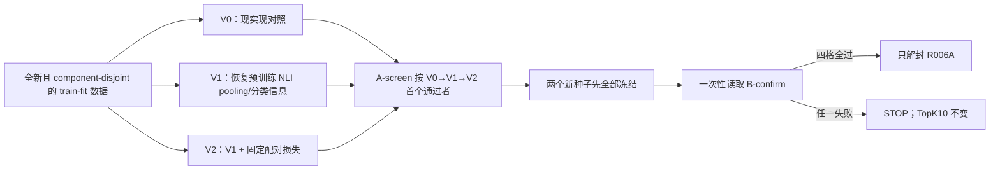

# 自适应保守 Selector：R005A/R005B 修订执行计划

**版本：** amendment v1  
**日期：** 2026-08-12  
**状态：** `DRAFT / WAITING FOR USER APPROVAL / NOT IMPLEMENTED / NOT RUN`  
**上游状态：** R001–R004 PASS；原 R005 永久保持 `COMPLETE / TRAINING-GATE FAIL`  
**生产默认：** TopK10，保持不变  
**效果数据边界：** 本修订不得读取 train-modelval、decision-dev、CRC-calibration、sealed600 或 heldout 的 Selector 效果

> 这是一条新的、事前冻结的 sanity 路线，不是把失败的 R005 改答案。只有用户明确批准本文件后，才允许实现代码和物化样本；只有 R005A 与 R005B 全部通过，才允许新建 R006A。原 R006 仍保留为 `CUT BY ORIGINAL R005`。

---

## 0. 零基础先看这里

### 0.1 R005 真正卡在哪里

R005 的模型并非完全没有信号：16 组 provenance 严格核验的确定性合成 clean/counterfactual 代理证据，其相对顺序全部正确；NIAH protect AUC 为 `0.9826`，harm AUC 为 `0.9297`。但是少数正确与错误代理证据的分数互相穿插。这里不是开放世界 misinformation 真值。

把阈值想成尺子上的一条切线：

- 如果只是切线位置错了，移动切线应能把两类分开；
- 但 protect 要求切线同时 `>0.30055` 和 `≤0.21465`；
- harm 要求切线同时 `>0.55774` 和 `≤0.48020`；
- 两个区间都是空的。

因此，**只调 `0.5` 或只做单调 calibration 不能解决原 R005**。详细复算见 [`R005_POSTHOC_DIAGNOSIS_2026-08-12.md`](R005_POSTHOC_DIAGNOSIS_2026-08-12.md)。

### 0.2 代码中确认了一处什么问题

冻结的 cross-encoder snapshot 本来是 `DebertaV2ForSequenceClassification`，其中已有：

```text
DeBERTa encoder
→ 已训练的 ContextPooler
→ classification dropout
→ contradiction / entailment / neutral 三分类器
```

原 R005 却通过 `AutoModel` 只加载基础 encoder，正式环境明确没有采用 pooler 和 classifier 四个参数；随后直接取 raw CLS，并随机初始化两只一维 head。encoder 和随机 head 还共用较小的 `2e-5` 学习率。

“预训练分类路径被丢弃”是已核实的实现事实；“它就是 R005 失败的原因”仍只是新实验要检验的假设。

### 0.3 新方案怎样逐层回答原因



- **V0 通过：** 只支持“amendment-control 整体包已经足够”，其中同时包含新的 eligibility、fit-only threshold 和 pair-preserving batching；不能把通过单独归因于“小样本”或“阈值迁移”。按预注册复杂度顺序保留最简单方案。
- **V0 失败、V1 通过：** 支持“丢弃原 NLI 表示路径”假设。
- **V1 失败、V2 通过：** 支持“只有平均 BCE 不足以拉开配对间隔”假设。
- **三者都失败：** 当前小型 scorer 路线停止，不继续拿阈值碰运气。

这仍然只是“模型能否在新 component 上稳定学会”的资格考试。即便全过，也不能声称 Selector 已优于 TopK10；真正的微小提升、harmful reduction、recall/chain 损失和置信区间仍由 R006A 之后的独立效果阶段检验。

---

## 1. 文献原则如何落到本修订

本修订不再堆叠新系统，只保留原计划中与当前失败直接相关的原则：

| 工作 | 保留的启发 | 本修订中的具体动作 | 不声称什么 |
|---|---|---|---|
| Provence（ICLR 2025） | 轻量 cross-encoder 可以作为上下文 pruner/scorer | 修复并严格对照 DeBERTa cross-encoder 的 sequence-classification 表示路径 | relevance scorer 不自动等于 misinformation detector |
| SetR / Beam Retrieval | 多跳价值是同题证据集合/配对关系，不应把每条 row 假装独立 | NIAH clean/cf 配对损失；以每个 query 的复合成功作为主门 | 不重新引入无约束 beam 或大型 CoT selector |
| NEST | 先固定 retrieval 候选，再在实际动作域内做 precision selection | 资格与保护门只针对默认 TopK10；rank 11–20 不反向筛掉题目 | R005A/B 不执行真实删除或补位 |
| Conformal Risk Control | 选择/校准与最终检验必须隔离，失败时回退 P0 | fit、screen、confirm 严格分开；TopK10/P0 保持默认 | sanity 的 binomial bound 不是 CRC，也不是部署安全认证 |

CRC 本身不能让错误 scorer 变准确，所以本修订只修 scorer 资格门；原 component-aware CRC 仍保留到后续 calibration 阶段。

---

## 2. 永久冻结、不重新讨论的内容

以下证据继续有效，并且本修订不得改变：

1. R001 六个 Hybrid Top20 pool、query/document/corpus 对齐和逐题 hash；
2. R002 component map、数据角色、风险定义、component representative 与 CRC 协议；
3. R003 TopK10/9/8/7 数量基线与逐题 count-matched 协议；
4. R004 标签、mask、provenance 核验、输入隔离和 GPU 资源证据；
5. 原 R005 的样本、配置、checkpoint、分数、报告和正式 FAIL；
6. 模型输入只能是 `question + candidate_text`；ID、rank、component、role、provenance 和标签不得进入编码输入；
7. 生产唯一默认为 TopK10；P0 是 0 删除；不确定时 `ABSTAIN_KEEP`；
8. 新 Selector 若以后运行，也只在 TopK10 内 0–cap 删除，不从 rank 11–20 补位；
9. R005、R005A、R005B 的 checkpoint 和数值阈值全部是 sanity-only，不得初始化或直接配置 R006A/R007；
10. 任何失败 artifact 都保留，不能删掉失败后换同一确认集重试。

---

## 3. 新样本：完全避开已经看过的 R005 component

### 3.1 固定输入 pins

| 输入 | SHA-256 |
|---|---|
| 原 R005 `sanity/sanity_sample.jsonl` | `5f30a67607872a7825628800215fed0e40a126b74dc81abdc46c0b9da413a175` |
| NIAH `component_map.jsonl` | `86be62b1fb6c25e335692ce1041284fbc8cc4341a30370224003ebf2872bc2ab` |
| 2Wiki `component_map.jsonl` | `394fb41123322b08c618ce3d94ec3dc6bb1f4666bceb1f32e1e7019e241fe298` |
| NIAH `selector_labels.jsonl` | `936c3fc0757be62802c10087f74f8cb2dc31c93bbe4e7083c40578e7da8d73b1` |
| 2Wiki `selector_labels.jsonl` | `9a39cdd05b096d24e77ff89c01027b973870afddbfb0497ecfa668c04f9bbf8c` |
| NIAH `candidate_sets.jsonl` | `09e8c9b4972f48a67661c8b06dcf220f178528156699da671a16dd8d08fb908f` |
| 2Wiki `candidate_sets.jsonl` | `0ab0fc92f95add1c5d514f531e7b567c4e67d1e5430c401f37ec6f719dbc8887` |
| 2Wiki `gold_cases.jsonl`，只作完整链审计 | `b62cc139f390067322b0337431dc962d4befca77026667f1f347e1f09380165b` |
| base `model.safetensors` | `d8148c6d49e0a7925134294c56326c71fe0ab1dc390e37355e00c7efbb488afa` |

### 3.2 资格条件与可用数量

先删除 **任何包含原 R005 32 个 query 的整个 component**，而不是只删这 32 题。

| 数据 | 最终资格 | query | component |
|---|---|---:|---:|
| NIAH | 唯一 verified clean/cf pair，四个 active 标签完整，clean 与 cf 均在 TopK10 | 778 | 719 |
| 2Wiki | TopK10 至少有一条 official supporting evidence | 2,677 | 2,078 |

2Wiki 不采用“所有 active supporting chunk 都在 TopK10”条件。该条件会过滤 179 题、让 136 个 component 消失，却没有提高真正 gold-chain-complete 比例；原因是同一官方文档的重复 chunk 可能落在 11–20。Selector 的动作域本来就是 TopK10，因此正确规则是：

- 只要 TopK10 至少有一条官方正确证据即可入选；
- 保护门检查 TopK10 内 **全部** official supporting evidence；
- 真正完整 gold chain 是否在 TopK10 单独报告为 conditional-chain 诊断，不参与抽样资格。

### 3.3 四个角色

每个 component 只取一个事前哈希代表 query，并按固定 component 哈希顺序连续切片：

| 角色 | 每数据源 query/component | 用途 | 是否可调方法 |
|---|---:|---|---|
| R005A-fit | 64 | 训练 seed13、拟合两只 sanity 分类阈值 | 否 |
| R005A-screen | 96 | 按复杂度顺序选择唯一 variant | 只允许冻结的 V0→V1→V2 |
| R005B-fit | 64 | seeds42/73 各自独立训练、各自拟合阈值 | 否 |
| R005B-confirm | 128 | 两 seed 一次性确认 | 绝不允许 |

四角色合计每数据源 352 个 component；NIAH 仍剩 367 个未使用合格 component，2Wiki 仍剩 1,726 个。

### 3.4 哈希抽样规则

```text
protocol = selector-r005-amendment-v1
seed = 20260812

representative_digest =
sha256(protocol + "\nrepresentative\n" + dataset + "\n" +
       component_id + "\n" + query_id + "\n" + seed)

component_order_digest =
sha256(protocol + "\ncomponent-order\n" + dataset + "\n" +
       component_id + "\n" + seed)
```

每个 component 选择 `(representative_digest, query_id)` 最小的合格 query；component 按 `(component_order_digest, component_id)` 排序，然后依次切 `[0,64)`、`[64,160)`、`[160,224)`、`[224,352)`。digest 输入均为原 UTF-8 字符串、不做 Unicode normalization、无结尾换行。

`sample_digest` 固定为：

```text
sha256(protocol + "\n" + role + "\n" + dataset + "\n" +
       component_id + "\n" + query_id + "\n" + seed)
```

### 3.5 预冻结分区指纹

canonical JSONL 使用 `ensure_ascii=false`、`sort_keys=true`、分隔符 `(',', ':')`、UTF-8 无 BOM、LF 换行且末行有 LF。assignment 固定保存 schema/protocol/seed/eligibility/role/dataset/index/component/query 及三个 digest；candidate 固定保存 role/dataset/component/query/evidence/document/rank、candidate-text SHA、text-pair SHA 与四个 label/mask 字段。实现不得增删字段后仍沿用以下 hash。

| 角色 | 行数 assignment / Top20 / Top10 | Combined assignment | Combined Top20 | Combined Top10 |
|---|---:|---|---|---|
| R005A-fit | 128 / 2,560 / 1,280 | `342d90e4cf324c96a541cee6fce962be770b57ca52ab4c1b93f330c3c8af7491` | `301e910f67b78ec8c898049d89fd8841eb72b9bb8de3c9e3ae8400fb512ebde4` | `b9dcf6a3cabd1c69fdef4d9e42d699cd4ea9ba693b0b4ec3478138e386fcb759` |
| R005A-screen | 192 / 3,840 / 1,920 | `a992f1b76abfac727981a79cdaf20d034aa7f8641d8e5d4a7713c9ecfa5bd15c` | `e3ca8cbb3b5842516af7e5c3ca2c7d31858c85a810ad93a8480b7a9ce7e0228c` | `908880c6a31d58c5902e01a20b08eb770aec58d6cbcbe3146ea4494c5cd1ef5e` |
| R005B-fit | 128 / 2,560 / 1,280 | `d571a85eb91c3a3a9128124c0c627f6de27d604b5eb4a49510edf0a6fb573111` | `e46276b5e4a700cd313c81bff23470eaade78d5d17e82f866f29ebf39b1b1c55` | `efc358a08b1814337d60fa56d0f7c3757ccb5b9fc4d539708ba97fb9d38052fa` |
| R005B-confirm | 256 / 5,120 / 2,560 | `676cdb6cfb51626b98959a53ea7d81774b042cc64be0e4e6a09ba3046016832a` | `bb33ac9268a3405149cc2e428aa552323e0dc7be976a8f3164ead5e8ffc5fb60` | `3259c1bbe613d04f7f6023138451e725c1d5fbe12561e45ef57f4d44abb2a0fa` |

combined bytes 固定按 `niah → 2wiki` 拼接原始 canonical JSONL bytes，不是把两个已有 SHA 再 hash。四角色 assignment 按表中顺序继续拼接后的总 SHA 为：

```text
8b5551e8265ed67c76fd43cd8cf8886892d5a22e143af86411dc98ed64a19fb5
```

这些值由不编辑实现代码的独立 data-only reviewer 事前复算；传回本计划的只有聚合行数、hash 与隔离结论，没有 held-out query ID、文本或标签。批准后的顺序固定为：先完成 A001 代码/测试冻结，再由该 clean commit 的封闭 A002 materializer 在服务器复算。A002 可公开物化 A-fit/B-fit；对 A-screen/B-confirm 只允许在隔离进程内流式重算行数/hash/隔离并输出 PASS/FAIL，不得在 reveal 前落盘或输出具体 assignment、文本、标签、token 或 model-dependent cache。held-out canonical bytes 只能在相应 session 的 durable `REVEAL_STARTED` 后由同一冻结代码在私有 staging 中重建。任一 hash 不一致都在训练前 `TECHNICAL INVALID / STOP`。

### 3.6 “完全隔离”准确指什么

必须为零：

- 原 R005 与四新角色的 component overlap；
- 四角色间的 query/component overlap；
- 四角色间 `(dataset, query, evidence)` 复合 candidate identity overlap；
- 四角色间完整模型输入 `text_pair_sha256` overlap；
- active-supervised canonical evidence/content overlap。

不要求共享语料库中的 raw document、raw `evidence_id` 或纯 candidate text 全部不同；同一文档可被不同问题召回，但因 question 不同，不是同一个模型输入。所有准确率与置信区间以 **query/component** 为单位，绝不把 evidence row 当独立样本。

---

## 4. 三个且只有三个 variants

所有代码、initializer、loss、batch schedule、阈值算法、配置、sealed materializer、reveal 状态机和 closed-world gate verifier 必须先在 A001 位于同一个 clean commit，并只用原 R005 train-fit 证据和合成 fixture 通过测试；随后才允许 A002 复算任何新角色。禁止在实现冻结前查看新 A-screen/B-confirm 的具体 assignment、文本、标签或 token，也禁止看到某个 screen 错误后再实现或调整下一 variant。

### V0 — amendment control

- 当前 `AutoModel → raw CLS → two random Linear(768,1)`；
- active-mask weighted BCE；
- 从原 base snapshot 重新初始化，不载入 R005 checkpoint；
- 为公平对照，使用本修订统一的 pair-preserving batch schedule，因此叫 amendment V0，不冒充原 R005 原样复跑。

### V1 — 恢复预训练 NLI 表示路径

```text
shared pretrained DeBERTa
→ shared pretrained ContextPooler
→ shared classification dropout（每次 forward 只调用一次）
├─ independent protect 3-logit classifier copy
└─ independent harm 3-logit classifier copy
```

原 snapshot 标签固定为：`0=contradiction, 1=entailment, 2=neutral`。两只 classifier 初值相同但 parameter storage 必须完全独立。

若原三分类 logits 为 `zC, zE, zN`：

```text
protect_logit = zE - logsumexp(zC, zN)
harm_logit    = zC - logsumexp(zE, zN)
```

分别做 sigmoid 后，在初始化时严格等于原 NLI 模型的 entailment 与 contradiction softmax 概率。不能用“目标行减其他行平均”的近似 Linear 公式。

V1 与 V0 使用同样数据、BCE、batch、optimizer 和统一 `2e-5` 学习率；不同时引入 differential LR，以便只检验表示路径。

### V2 — V1 + 唯一固定 pairwise objective

只对每个 verified NIAH clean/cf query pair 使用 scalar logits：

```text
L_pair = mean_q 0.5 * [
    softplus(-(protect_logit(clean) - protect_logit(cf)))
  + softplus(-(harm_logit(cf) - harm_logit(clean)))
]

L_total = L_masked_BCE + 0.5 * L_pair
```

- 内层 `0.5` 是两只 head 的平均；外层 `0.5` 是冻结的 λ；
- 按唯一 query pair 平均，使用 logits，不用 sigmoid 后概率；
- singleton 与 2Wiki pair loss 必须是 graph-connected exact zero；
- 缺失、重复、跨 query 或歧义 pair 一律 fail closed；
- 不增加 safe-margin、temperature、第三只 head 或 loss sweep。

### 明确排除

本修订不测试新 backbone、分层冻结、多个 LR、多个 λ/margin、focal loss、三分类互斥输出、LLM verifier 或 source-voting。未来若需要，必须使用新的未见 confirm component 和新 amendment。

---

## 5. 公平训练与 batch 冻结

### 5.1 Pair-preserving schedule

当前 R005 batch 会按单候选打散，不能公平加入 pair loss。因此三个 variant 必须共用同一份事前冻结的 batch manifest：

- NIAH 每个 strict clean/cf pair 必须在同一 microbatch；
- 一个 NIAH microbatch 放一个完整 pair，再放最多两个 singleton；
- 每个 strict pair 每 epoch 恰出现一次；每个 candidate 不重复、不遗漏；
- 2Wiki 保持同一确定性 batch 规则；
- V0/V1/V2 的 candidate 顺序、microbatch 数、gradient accumulation 和 optimizer steps 完全相同；
- V0/V1 的 `pair_loss_weight=0`，V2 为 `0.5`，并复用同一次 forward；
- 不为 V2 额外 forward 一遍 pair，避免把额外计算量/dropout 视图混入对照。

batch manifest 至少记录 epoch、dataset、microbatch index、query/evidence、pair ID 和 batch digest；三个 variant 的 manifest SHA 必须相同。

### 5.2 共同训练配置

| 项 | 冻结值 |
|---|---|
| epochs | 30 |
| batch size | 4 |
| gradient accumulation | 4 |
| source schedule | NIAH : 2Wiki = 1 : 1 |
| optimizer | AdamW |
| learning rate | `2e-5` |
| weight decay | `0.01` |
| betas / epsilon | `0.9 / 0.999 / 1e-8` |
| scheduler / clipping | none / none |
| precision / max length | float32 / 512 |
| checkpoint | final completed epoch only |
| class weighting | R005 active-mask inverse-sqrt source/head/class rule |

随机性必须由 run seed 固定；CUDA deterministic 设置、模型/optimizer/batch fingerprint、完整 epoch trace与峰值显存全部保存。

---

## 6. 两只 sanity 分类阈值怎样拟合

每个 checkpoint 只从自己的 fit 角色拟合一个全局 protect threshold 和一个全局 harm threshold。A-screen、B-confirm 和任何后续 split 均不得参与。

候选阈值由 fit 分数的唯一有序值构成：低于最小值的 `nextafter`、相邻唯一值的稳定中点、高于最大值的 `nextafter`。分数先按模型 float32 输出写成精确可复算的 JSON number，再转 IEEE-754 binary64 枚举；`nextafter` 固定朝 `-∞/+∞`，中点固定为 binary64 的 `left + (right-left)/2`，禁止 decimal 四舍五入后枚举。正类规则固定为 binary64 比较 `score >= threshold`。

### Protect threshold

对每个候选阈值计算三个 query-level rate：

1. NIAH canonical cf 全部预测 protect-negative；
2. NIAH 每题 TopK10 全部 active protect-positive/required evidence 预测 positive；
3. 2Wiki 每题 TopK10 全部 official supporting evidence 预测 positive。

依次按以下冻结顺序选唯一值：

1. 最大化三者中的最小 rate；
2. 最大化三者平均 rate；
3. 距离 `0.5` 最近；
4. 仍并列时选更低 protect threshold，偏向保留正确证据；
5. 最后按 IEEE-754 数值升序。

### Harm threshold

计算 NIAH canonical clean 的 negative rate 与 cf 的 positive rate；依次最大化较差 rate、平均 rate、距离 `0.5` 最近；仍并列时选更高 harm threshold，偏向少删。

阈值候选表、每次 tie-break 与最终 SHA 必须在任何 screen/confirm 分数产生前冻结。raw `0.5` 结果仍并列报告，但不用于事后换规则。这两只阈值只是 sanity 分类阈值，不是未来 `DROP_HARM` 策略阈值。

---

## 7. 主门：每道题必须同时“删得明白、保得完整”

### 7.1 为什么按 query 计一次

同一道题的多个 label、候选和三个配对方向彼此相关，不能把它们当成许多独立样本来放大 n。每个 component 只有一个代表 query，每题最终只记成功 `1` 或失败 `0`。

### 7.2 NIAH 复合成功

`NIAH_success(q)=1` 只有当以下条件全部成立：

1. canonical clean：protect-positive、harm-negative；
2. canonical cf：protect-negative、harm-positive；
3. 三个严格方向都正确，tie 也算失败：
   - `protect(clean) > protect(cf)`；
   - `harm(cf) > harm(clean)`；
   - `safe(cf) > safe(clean)`，其中 `safe=min(harm,1-protect)`；
4. 该题 TopK10 内全部 active protect-positive/required evidence 都被预测 protect-positive。

### 7.3 2Wiki 复合成功

`2Wiki_success(q)=1` 只有当 TopK10 至少一条 official support 且 TopK10 内全部 official supporting evidence 都预测 protect-positive。

### 7.4 组成项

四个 canonical 类别、三个方向、all-required/all-support、candidate-level AUC/Brier/ECE/margin、raw-0.5 结果都必须报告；但主 Go/Stop 不把这些相关 row 分别当独立 n。复合成功是 AND，所以任一组成项失败都会反映在 query 主门中。

---

## 8. 置信区间与确切通过数

screen/confirm 对每个 query 复合成功率同时要求：

```text
observed success rate >= 0.95
one-sided exact 95% binomial lower bound >= 0.90
```

下界为 `Beta^{-1}(0.05; k, n-k+1)`，计算时不先四舍五入。

| 角色 | n/数据源 | 最少成功 | observed | exact lower bound |
|---|---:|---:|---:|---:|
| fit | 64 | 61/64 | 0.953125 | 不作 CI 声明 |
| A-screen | 96 | 92/96 | 0.958333 | 0.907188 |
| B-confirm | 128 | 122/128 | 0.953125 | 0.909583 |

零基础解释：`122/128` 是这批题看到的成功率；`0.9096` 下界是在当前抽样假设下，对“换一批同类合格 component”留出的保守余量。它不是“95% 的题一定安全”，也不覆盖现实世界分布变化。

NIAH 与 2Wiki、seed42 与 seed73 必须全部通过。四条下界各自是 marginal 95% bound，不能写成“四条同时 95% CI”。因为判定是 all-must-pass，不通过任何一项都不会放行；不得平均、挑 seed 或把两 seed 拼成 `n=256`。

这套门很保守：真实成功率恰好 95% 时也可能因抽样波动停止。项目目标是优先避免误删正确证据，因此接受“宁可停止，不用确认集放宽规则”的代价。

---

## 9. Run 顺序与不可偷看的执行方式

### 9.0 两次 reveal 共用的持久状态机

A-screen 的整段 `V0 → V1 → V2` 是一个 session；B-confirm 的“两 seed × 两数据”是另一个 session。以下 namespace 是协议常量，命令行和环境变量均不得覆盖，所有路径必须 `realpath` 等于字面值且不经过 symlink：

```text
namespace_anchor = /scratch/fl25387/IBM_Granite_Project_latest
run_root = /scratch/fl25387/IBM_Granite_Project_latest/runs/selector-r005-amendment-v1
audit_root = /scratch/fl25387/IBM_Granite_Project_latest/audit/selector-r005-amendment-v1
external_audit_root = /scratch/fl25387/IBM_Granite_Project_latest/audit-journal/selector-r005-amendment-v1

A split_id = R005A-screen
A session_id = selector-r005-amendment-v1--R005A-screen--a992f1b76abfac727981a79cdaf20d034aa7f8641d8e5d4a7713c9ecfa5bd15c
A final_bundle = /scratch/fl25387/IBM_Granite_Project_latest/runs/selector-r005-amendment-v1/R005A/SCREEN_SESSION_BUNDLE

B split_id = R005B-confirm
B session_id = selector-r005-amendment-v1--R005B-confirm--676cdb6cfb51626b98959a53ea7d81774b042cc64be0e4e6a09ba3046016832a
B final_bundle = /scratch/fl25387/IBM_Granite_Project_latest/runs/selector-r005-amendment-v1/R005B/CONFIRM_SESSION_BUNDLE
```

### 9.0.1 五个 formal fit job 的全局唯一注册

在第一项正式 fit 前，必须原子安装并 `fsync`：

```text
fit_registry = /scratch/fl25387/IBM_Granite_Project_latest/audit/selector-r005-amendment-v1/formal-fits/FORMAL_FIT_REGISTRY.json
fit_claim_root = /scratch/fl25387/IBM_Granite_Project_latest/audit/selector-r005-amendment-v1/formal-fits/claims
fit_job_audit_root = /scratch/fl25387/IBM_Granite_Project_latest/audit/selector-r005-amendment-v1/formal-fits/jobs
fit_run_root = /scratch/fl25387/IBM_Granite_Project_latest/runs/selector-r005-amendment-v1/formal-fits
```

registry 是 write-once canonical JSON，必须恰有以下 5 个 ordinal/job/root/claim，不能增删、改名或换根：

| ordinal | job ID | seed / variant | literal run root | literal budget claim |
|---:|---|---|---|---|
| 1 | `R005A-V0-S13` | 13 / V0 | `<fit_run_root>/R005A-V0-S13` | `<fit_claim_root>/01-R005A-V0-S13.json` |
| 2 | `R005A-V1-S13` | 13 / V1 | `<fit_run_root>/R005A-V1-S13` | `<fit_claim_root>/02-R005A-V1-S13.json` |
| 3 | `R005A-V2-S13` | 13 / V2 | `<fit_run_root>/R005A-V2-S13` | `<fit_claim_root>/03-R005A-V2-S13.json` |
| 4 | `R005B-VSTAR-S42` | 42 / 唯一 A-screen V* | `<fit_run_root>/R005B-VSTAR-S42` | `<fit_claim_root>/04-R005B-VSTAR-S42.json` |
| 5 | `R005B-VSTAR-S73` | 73 / 同一 V* | `<fit_run_root>/R005B-VSTAR-S73` | `<fit_claim_root>/05-R005B-VSTAR-S73.json` |

表中的 `<fit_run_root>`/`<fit_claim_root>` 只为缩短显示，registry 内必须写出上方完整 absolute literal path。每个 job 的 audit 路径固定为 `<fit_job_audit_root>/<job_id>/{FIT_JOB_ANCHOR.json,FIT_STARTED.json,FIT_TERMINAL.json,OWNER_LOCK}`，也必须在 registry 写成完整路径。registry 绑定 A001 code commit、A002 fit sample hashes、base snapshot、5 jobs、max 5 claims、max 150 aggregate epochs 与 2.0 GPU-hour；B 两项还规定开始时必须绑定唯一 valid R005A screen bundle/terminal SHA 和 V*，两 job 的 V* 必须一致。

每个 job 在持有并核验自己预创建 `OWNER_LOCK` inode/`st_dev` 的 exclusive flock 时，先安装 anchor，再用 no-replace 安装对应 budget claim，最后安装 `FIT_STARTED`；claim 绑定 registry/job-anchor/attempt，`FIT_STARTED` 绑定 claim SHA，三者避免循环引用。claim 或 STARTED 任一已存在、缺失、冲突，alternate root、重复 job ID/seed、未注册 checkpoint，或发现 registry 外 formal-fit artifact，都使整个 amendment STOP。拿不到 job lock 的第二进程零训练、零变更退出；拿到锁后若看见 STARTED 无 valid terminal，写 `FIT_TERMINAL=FAIL` 并整体 STOP，绝不 resume。

`FIT_STARTED` 必须先于 model forward/optimizer 初始化；job owner 持锁到 final checkpoint、fit scores/gate、artifact closure 全量复验并安装唯一 `FIT_TERMINAL={COMPLETE|FAIL}` 后。COMPLETE 与 FAIL 必须把完整 canonical payload 写到唯一 temp、关闭可写句柄/设只读并 file `fsync`，再对同一个固定 `FIT_TERMINAL.json` 使用 atomic no-replace hard link，最后 parent `fsync`；只能有一个 outcome，禁止覆盖、删除或补写旧 terminal。terminal 无 matching STARTED、partial/invalid terminal、安装 `EEXIST`/hash 冲突，或 STARTED 后没有 valid terminal，都永久使整个 amendment STOP；只能在同一路径 no-replace 安装 FAIL（若路径仍空），绝不把 FAIL/invalid 状态复活为 COMPLETE。valid COMPLETE terminal 绑定并重验 registry、anchor、claim、STARTED、checkpoint、fit-score、threshold/gate hashes及其 canonical payload SHA；ordered reveal member 必须绑定这些五类 SHA，不能只指向 checkpoint。任何一个 formal fit claim/STARTED 出现后，禁止产生新 A001 commit、重跑 A002 或重新注册预算；如需修复，只能停止本 amendment 并另写新计划/新数据。formal-fit verifier 必须 closed-world 扫描 canonical roots，证明总 claim `≤5`、每 job 恰好 0 或 1、总 completed epochs `≤150`、累计 GPU-hour `≤2.0`，且不存在可选择的第二 checkpoint/run root。

R005A→R005B 的授权事件固定为 `/scratch/fl25387/IBM_Granite_Project_latest/audit-journal/selector-r005-amendment-v1/authorizations/R005A_TO_R005B.json`；R005B PASS 只允许提出 R006A 协议的事件固定为同目录 `R005B_TO_R006A_PROTOCOL_PROPOSAL_ONLY.json`。它们是 write-once canonical JSON，绑定 source split/session/attempt、五件链各 SHA、无 veto复验与授权类型，并在持有相应 reveal `OWNER_LOCK` 时安装/`fsync`。它们位于 `events/` 目录之外，不计入每个 reveal session 恰好两个 event 的约束；第二个事件明确不是 GPU-run authorization。

每个 split 的唯一注册点为 `<audit_root>/splits/<split_id>/SPLIT_ANCHOR.json`，永久否决点为同目录 `REVEAL_INVALIDATED.json`，进程互斥文件为同目录预创建的 `OWNER_LOCK`；每个 session 的 marker 为 `<audit_root>/sessions/<session_id>/{REVEAL_STARTED.json,REVEAL_TERMINAL.json}`；external events 固定为 `<external_audit_root>/sessions/<session_id>/events/{0001-STARTED.json,0002-COMPLETE_INTENT.json}`。split anchor 绑定上述所有 literal path、唯一 session ID、assignment SHA、protocol/code SHA、root realpath、`st_dev` 与 `OWNER_LOCK` inode；任何其他 root/session/final path 均无授权效力，并触发 split-level invalidation。

批准后先在首次 reveal 前预建 canonical roots、split/session/events/final-parent 目录；每新建一级都必须 `fsync` 该目录及其父目录，逐级回到已存在的 `namespace_anchor`，并保存 mount/realpath 复验。空的 canonical 目录可重验复用；没有 matching STARTED 时若发现任何 temp、event、terminal、staging、bundle 或非空 orphan artifact，一律先安装 `REVEAL_INVALIDATED`、隔离产物并永久 STOP。最终 bundle 发布使用 `renameat2(RENAME_NOREPLACE)`；环境不支持 no-replace hard link、`renameat2`、目录 `fsync` 或同文件系统发布时，reveal 不得开始。

`REVEAL_TERMINAL.json` 是唯一互斥 write-once 终态，payload 只能为 `COMPLETE` 或 `BURNED`。`REVEAL_INVALIDATED.json` 是 split-level write-once veto：一旦出现，无论 terminal 内容或后来是否补齐文件，该 split 永远不能成为 valid COMPLETE，也不能换 session 重跑。marker/veto/event 均用 canonical temp file → 关闭可写句柄 → 只读 → file `fsync` → atomic no-replace hard link → parent `fsync` 安装，禁止删除、覆盖或回滚。

**消除 COMPLETE/veto 的并发时间差。** 所有 split 状态读取、marker/event/veto/terminal 安装、结果发布、valid-COMPLETE 检查及任何 R005B/R006A 下游授权，都必须由同一进程对 canonical `OWNER_LOCK` 持有 nonblocking exclusive `flock` 的整个临界区内完成。只有成功取得锁并核验 anchor 中 lock inode/`st_dev` 的进程才可改变或接受状态；拿不到锁的第二启动者必须在零 held-out access、零文件变更的情况下立即退出，**不得迟到安装 veto**。持锁进程若看到旧 STARTED 无 valid terminal，才可执行恢复 invalidation/BURN。owner 必须在 COMPLETE 已安装、五件链+无 veto 又重验通过并完成本次授权记录后才能释放锁；因此不存在“owner 检查无 veto 后，loser 再写 veto但下游已获准”的窗口。任何后续授权也重新独占同一锁并全量重验；锁机制/anchor 不可用则不授权。

**实现冻结与 held-out 密封。** A001 必须先完成 clean implementation commit。之后唯一允许在 STARTED 前读取 held-out 源数据的是该 commit 中的 sealed A002 preflight 子进程；它不得写出 held-out raw rows/token cache，只能返回预冻结聚合 count/hash/isolation PASS。任何人、agent 或其他命令在 STARTED 前读取/打印 A-screen/B-confirm 的 assignment、query ID、文本、标签、token，或任何 model-dependent score/count cache，都算未授权 reveal，立即 invalidation/STOP。相应 held-out canonical rows/token 只在 STARTED 后由冻结 wrapper 重建到私有 staging。

**ordered input-set 的唯一字节定义。** 每个 session 的 `ordered_reveal_members.json` 是一个 canonical JSON array：`ensure_ascii=false`、`sort_keys=true`、separators `(',', ':')`、UTF-8 无 BOM，末尾一个 LF。A 的成员顺序严格为 ordinal `0/1/2 = V0/V1/V2`，B 为 `0/1 = seed42/seed73`；ID/ordinal 不得缺失、重复、交换或增加。每个 entry 固定包含：`ordinal`、`member_id`、`fit_registry_sha256`、`fit_job_anchor_sha256`、`fit_budget_claim_sha256`、`fit_started_sha256`、`fit_terminal_sha256`、`config_sha256`、`checkpoint_file_sha256`、`checkpoint_state_fingerprint`、`fit_gate_manifest_sha256`、`fit_score_sha256`、`protect_threshold_binary64_hex`、`harm_threshold_binary64_hex`、`threshold_candidate_table_sha256`、`threshold_trace_sha256`、`pair_batch_manifest_sha256`、`sample_assignment_sha256`、`tokenizer_manifest_sha256`、`protocol_sha256`、`code_commit`。binary64 固定为 IEEE-754 big-endian lowercase 16-hex。四个 ordered set-manifest 是上述 array 对 config、checkpoint、fit-gate、threshold 字段的固定 ordinal/ID 投影，用同一 canonical 编码计算；禁止按目录枚举。总 reveal-input manifest 绑定完整 member array、四个投影 SHA、split anchor SHA、sealed sample hashes、final path 和 closed-world verifier file SHA。

每个 session 使用以下不可重试状态机：

1. **取得锁并恢复预检。** launcher/recovery 先 nonblocking 独占 canonical `OWNER_LOCK`；失败者零访问、零变更退出。持锁者在加载 scorer 或访问任何 held-out 内容前 closed-world 枚举 split/session/event/final/staging namespace。已有 veto 或 BURNED 即永久 STOP。没有 STARTED 但有任一 orphan artifact即安装 veto并 STOP。STARTED 无 terminal说明旧 owner 已中断：当前持锁 recovery 安装 veto和 terminal=`BURNED`，绝不 attach、resume 或重新评分。terminal 无 STARTED 也安装 veto并 STOP。
2. **取得唯一 reveal 所有权。** 持锁的唯一 launcher 先安装 split anchor，再安装绑定全部 ordered inputs/final path/attempt ID 的 STARTED marker，最后安装 `0001-STARTED.json`；该 event 必须绑定实际 `started_marker_sha256`、session/split/attempt。在持锁状态下任何 no-replace `EEXIST`、owner/attempt 不匹配、STARTED event 安装失败或额外 event 都安装 veto并 BURNED/STOP。marker 与 matching event 都持久化后，owner 才可读取 held-out；全流程直至 valid COMPLETE/STOP 和授权记录完成前不释放锁。
3. **私有计算、一次发布。** 所有 score、计数和单项 gate 只写私有 staging，不进 stdout/log。A-screen 只评分 A-fit classification-qualified variants，并按 `V0→V1→V2` 顺序；内部失败不逐项发布，只在首个 PASS 或全部 eligible variants FAIL 后发布一次 session bundle。B-confirm 只发布一次四格联合 bundle。
4. **closed-world 发布。** verifier 先拒绝缺失/额外文件、row/cell/query 不全、非法 A 顺序前缀或 B 四格不全；再 `fsync` staging 全部文件/目录、关闭写句柄并设只读。最终路径必须不存在；用 `RENAME_NOREPLACE` 发布，随后 `fsync` destination parent，从 final path 完整重读复验。目标已存在、rename/verify 失败或任何冲突都先安装 veto，再 BURNED/STOP。
5. **申请 COMPLETE。** 预先构造不含自身 hash 的 COMPLETE terminal canonical payload：`outcome`、实际 started marker SHA、session/split/attempt、published bundle manifest SHA。`0002-COMPLETE_INTENT.json` 绑定该 terminal payload SHA 和相同各 SHA/ID，原子安装并 `fsync` event directory；随后仍持 exclusive lock 的 owner 对唯一 terminal path no-replace 安装 `COMPLETE`。不存在持锁期间的并发 recovery；后续 recovery 只有取得锁后才能读取状态，若看到 STARTED 无 terminal才安装 veto/BURNED。terminal `EEXIST`、veto 已存在或状态冲突时，即使 bundle 已发布也必须 quarantine/STOP。
6. **永久接受谓词。** 在持有 canonical exclusive lock 时，valid COMPLETE 必须同时满足且每次下游授权前重验：实际 STARTED marker；唯一 matching、已 `fsync` 的 STARTED event；closed-world published bundle；唯一 matching、已 `fsync` 的 COMPLETE_INTENT；唯一 COMPLETE terminal；上述五者 session/split/attempt/hash 全一致；split veto 不存在；event directory 恰好只有预期两项且没有 BURNED/INVALID/额外/冲突事件。任一 COMPLETE 缺失、损坏或冲突时必须在仍持锁时安装 split veto，再隔离并 STOP；后来补文件也不得“复活”。只有重验和下游 authorization event 都持久化后才释放锁。

`STARTED → valid COMPLETE` 之间任何异常、`kill -9`、节点掉线、校验失败或不确定状态都按可能已经揭示处理。状态机、并发启动、每个崩溃窗口、orphan/veto 和路径替换必须有故障注入测试并由最终 verifier 重验。

**closed-world reveal bundle。** 两个 session 的最终目录都必须恰有下列 8 个文件：`protocol.json`、`reveal_input_manifest.json`、`candidate_scores.jsonl`、`query_composites.jsonl`、`cell_outcomes.jsonl`、`gate_summary.json`、`bundle_manifest.json`、`CHECKSUMS.sha256`。前六项是 payload。`bundle_manifest.json` 用本计划 canonical JSON 编码，固定包含 schema/session/split/attempt/input-manifest SHA，以及六个 payload 的 path、schema ID、byte size、row count、SHA；它不含自身 SHA、CHECKSUMS、marker、event 或 audit state。`published_bundle_manifest_sha256` 只对该文件 canonical bytes 计算。`CHECKSUMS.sha256` 恰好列出六个 payload 加 `bundle_manifest.json` 共 7 项，排除自身。A 的 candidate/composite/cell 行数必须精确等于“实际被评分的 fit-qualified 合法顺序前缀 × 3,840 / 192 / 2 dataset cells”，且不得含首个 PASS 后或 fit-ineligible variant；B 必须恰有 `10,240` candidate、`512` composite 和 `4` cell rows。A/B 各一份 gate summary。实现 commit 在任何新角色生成前冻结每个 row 的 exact field schema和 verifier file SHA；任何少项、多项、重复 query/cell、非法 prefix、schema/row/hash 不符均 invalidation/STOP。人类报告、attestation 与独立审计在 bundle 外生成，不参与上述闭包。

**语义重算，不信任派生总结。** `candidate_scores.jsonl` 是 bundle 内唯一结果 source of truth，但 verifier 不能盲信它：必须从 sealed role source、冻结 tokenizer、strict-reloaded checkpoint 和 ordered member manifest 独立重做 forward，并要求每个 protect/harm float32 的 IEEE-754 bit pattern、candidate identity、rank、mask/label 与原始 score row 完全一致。随后只能从这些已验证 raw rows 和 fit artifacts逐层重算：从冻结 fit scores/候选表/tie-break trace 重算每个 checkpoint 的两只 binary64 threshold 与 fit classification qualification；从 raw held-out scores、labels、masks 与 threshold 重算每个 query composite；从 composites 重算每个 dataset×member/seed cell 的成功数、observed rate 和 exact one-sided Clopper–Pearson lower bound；再重算合法 A eligible-prefix/首个 PASS 或 B 四格 all-must-pass；最后重建 `query_composites`、`cell_outcomes`、`gate_summary` 的 canonical bytes并要求逐字节相等。任何只检查 summary、自报 PASS、派生层不一致、漏/多 row 或不能从 raw source 重建的 bundle均 invalidation/STOP。

### 9.1 R005A：方法选择，只是 development evidence

在任何非 A002 sealed-preflight 的 A-screen held-out access 前，必须完成并冻结：

1. 三种 variant 的实现、测试、配置与同一 clean commit；
2. `R005A-V0-S13`、`R005A-V1-S13`、`R005A-V2-S13` 三个 A-fit checkpoint；
3. 三者各自 fit-only protect/harm threshold；
4. batch/sample/initializer/objective/checkpoint/threshold hashes；
5. 三者的 technical/execution gate 必须全部通过；任一 OOM、NaN、incomplete checkpoint、strict reload 或 artifact 错误都使 amendment STOP；
6. `NIAH/2Wiki >=61/64` 仅定义该 variant 是否取得 A-screen classification qualification：单个 variant 低于门槛就被预先淘汰、不得评分 screen，但不会阻止顺序尝试其他已经完成且合格的 variant；若三个都不合格则不读取 A-screen，amendment STOP。

随后由一个冻结的 reveal 命令按 `V0 → V1 → V2`：

- A-fit classification 未合格的 variant 不评分 A-screen；
- 对 complexity order 中第一个 fit-qualified variant 评分 A-screen；
- NIAH 与 2Wiki 都达到 `92/96` 且各自 exact lower `≥0.90` 时立即冻结它为唯一 `V*`；
- 第一个通过后，不读取更复杂 variant 的 A-screen 结果；
- 前一个 fit-qualified variant 的 screen 失败才允许揭示下一个 fit-qualified variant；全部 fit-qualified variants 都失败则 amendment `FAIL / STOP`。

reveal 过程不得输出任何 variant 的中间分数、计数或门结论。它必须遵守上述 durable marker 状态机，并在同一文件系统的 staging 中完成允许揭示的全部顺序评分与联合 gate，只在首个 PASS 或全部 eligible variants FAIL 后原子发布一次完整 session bundle。**一旦 A-screen 出现未授权 held-out access、任何 score 被访问/产生后异常，或 durable `REVEAL_STARTED` 后未形成第 9.0 节的五件一致链且无 veto 的 valid COMPLETE，该 split 立即永久 `INVALIDATED / BURNED / STOP`；不得换 root/session 或修代码后重跑。**

不按最高分选模型，多个潜在通过者也固定选择最简单的 `V0 < V1 < V2`。

### 9.2 R005B：独立确认

只对唯一 V*：

1. `R005B-{V*}-S42` 从原 base 在 B-fit 独立训练；
2. `R005B-{V*}-S73` 也从原 base 独立训练；
3. 两个 checkpoint、各自 fit threshold、fit gate、config/code/sample/hash 和 verify-only **全部先冻结**；
4. 任一 seed 的 B-fit NIAH/2Wiki 低于 `61/64`，直接 STOP，B-confirm 不评分；
5. 两个 seed 均合格后，由同一个冻结命令第一次读取 B-confirm，并一次性评分两者；
6. `seed × dataset` 四格均须 `≥122/128` 且 exact lower `≥0.90`。

禁止看 seed42 confirm 后再决定是否训练/修改 seed73；禁止换 variant、改 threshold、epoch、λ 或样本后重用 B-confirm。

B-confirm reveal 同样不得在 stdout/log 暴露中间 seed 或 dataset 结果；必须遵守上述 durable marker 状态机，并在同一 staging 中完成两 seed × 两数据的全部评分、联合判定、自验与 checksums 后只发布一次。**一旦 B-confirm 出现未授权 held-out access、任何 score 被访问/产生后异常，或 durable `REVEAL_STARTED` 后未形成第 9.0 节的五件一致链且无 veto 的 valid COMPLETE，该 split 立即永久 `INVALIDATED / BURNED / STOP`；不得换 root/session 或在该 split 上修复重试。**

### 9.3 最大预算

- A 最多 3 个训练 job，B 最多 2 个，共最多 5 个；
- 最多 150 aggregate epochs；
- RTX A4000 预计约 1.3–1.6 GPU-hour；硬上限 2.0 GPU-hour；
- 单 run 超过 0.4 GPU-hour、OOM 或 non-finite：封存并按第 10 节处理。

---

## 10. Fail-closed 与技术失败

### 10.1 结果产生前 technical invalid

只有发生在 A001/A002 或某个正式 fit job 启动前，并且该 job **尚未执行任何 optimizer step、尚未写 checkpoint、fit score 或 gate** 的纯结构预检错误，才是不产生科学 PASS/FAIL 的 `TECHNICAL INVALID`：

- 输入 SHA、样本行数、分区 SHA 或角色隔离不一致；
- label map、pooler/classifier shape、模型输入字段或 Top20/Top10 rank contract 不一致；
- 旧 R005 verify-only 回归失败；
- checkpoint builder 的预启动 architecture contract 与 variant 不一致；
- 其他在正式 fit job 启动前被 structural dry-run 捕获的普通代码异常。

此类问题只能回到新的 A001 clean commit，重跑 A001/A002，并重新证明尚未启动任何正式 fit；不能原地补丁后继续。**一旦任一正式 fit job 启动（以写入 write-once `FIT_STARTED` 且 `fsync` 为界）或产生任何 optimizer step/checkpoint/fit score/gate，之后的代码异常、保存失败、strict reload 失败或 artifact 不完整都属于第 10.2 节的 technical/execution FAIL，整个 amendment STOP，所有正式 fit job 均不得重跑。** `FIT_STARTED` 必须先于模型 forward/optimizer 初始化并进入 fit artifact contract。

第 9 节的 reveal 状态机优先于本节：一旦已有 `REVEAL_STARTED`，无论是否能证明 score 已产生，任何未形成五件一致链且无 veto 的 valid COMPLETE 都必须永久 `INVALIDATED / BURNED / STOP`。

### 10.2 运行期科学/资源 FAIL

- A-fit 任一 technical/execution gate 不通过即整体 STOP；单个 variant 仅 classification qualification `<61/64` 时预先淘汰并可继续其他已冻结合格 variant，三个都不合格才整体 STOP；A-screen 单个 eligible variant 不通过时按第 9.1 节进入下一个，全部 eligible variants 失败才整体 STOP；B-fit 任一 seed 资格门或 B-confirm 任一 seed×dataset 格不通过即整体 STOP；
- epoch 内 OOM、NaN、Inf；
- strict pair 被拆、重复、漏掉；
- 两 head 共享 storage、任一 head 未更新；
- active source/head full-fit loss 未按下述唯一口径下降；
- 2Wiki masked harm gradient 不为 exact zero；
- checkpoint strict reload 或语义重算失败。
- 正式 fit 的 `FIT_STARTED` 后发生代码异常、进程中断、保存失败或任何 artifact 不完整。

失败后保存 manifest、log、最后完整 epoch checkpoint和空的未执行下游 marker；不能删目录后悄悄重来。

“active loss 下降”的唯一口径为：分别在初始化模型和 final checkpoint strict reload 后设置 `model.eval()`、关闭 dropout；使用该 run 完整且完全相同的 fit rows、active masks、冻结 class weights 和确定性聚合顺序，重算 full-fit masked BCE。NIAH protect、NIAH harm、2Wiki protect 三项都必须有限且满足严格 `final < initial`；不得用训练态 dropout、末个 microbatch、epoch 平均 total 或不同权重替代。V2 的 pair loss 另行报告，但不代替这三项 BCE 门。

---

## 11. 实现前必须通过的测试

1. snapshot label map、三分类 shape、pooler/classifier key 缺失时 fail closed；
2. V1 初始化分数与原 NLI softmax entailment/contradiction 在容差内一致；
3. 两 head 初值相同但 storage 不共享；
4. pooler、一次 shared dropout、两 head 各注册且 optimizer 只包含一次；
5. V2 zero-margin loss=`log(2)`，四个 logit 梯度方向正确；
6. incomplete/duplicate/cross-query pair 拒绝；
7. pair batch 不拆分、无重复遗漏、三 variant batch SHA 相同；
8. 2Wiki pair contribution 和 harm gradient exact zero；
9. V0/V1 checkpoint cross-load 明确拒绝；新 checkpoint strict roundtrip；
10. fingerprint 对 pooler/head/objective/batch manifest 任一变化敏感；
11. threshold midpoint/tie-break、`61/64`、`92/96`、`122/128` 边界测试；
12. A/B reveal 顺序与 confirm one-shot 防泄漏测试；
13. formal-fit registry/claim/lock/terminal 的并发与故障注入测试：alternate root、重复 job/seed、第二 checkpoint、超 5 claims/150 epochs/2 GPU-hour、STARTED 后中断或新 A001/A002 均整体 STOP；
14. durable reveal 状态机测试：证明 A001 先冻结、A002 sealed aggregate-only 与 held-out 首次访问的边界；canonical namespace/split anchor/veto/OWNER_LOCK 和 ordered member projections 全绑定；持锁完成 STARTED/event/terminal/bundle 的 `fsync`、五件链重验和 authorization；模拟换 root/session、orphan、每个崩溃窗口、并发 loser 与 invalid COMPLETE 时都安全退出或永久 STOP；
15. semantic verifier 测试：checkpoint 重算 raw float32 bit pattern，fit threshold/qualification、query composite、cell count/rate、exact CP、A prefix/B all-must-pass 逐层重算；任一 raw/derived mutation、漏项或自报 summary 均拒绝；
16. 完整旧 R005 runner/finalizer `--verify-only` 回归继续 PASS；
17. 全仓测试、Ruff、mypy PASS。

旧 `load_dual_head_model`、旧 fingerprint schema 和旧 R005 verifier 必须保留原语义；新架构使用 versioned builder/protocol，不能原地让旧证据失效。

---

## 12. Artifact contract

每个 fit-training run 至少保存下列训练证据；A-screen/B-confirm reveal bundle 不采用“至少”语义，而必须严格服从第 9.0 节的 8-file closed-world 合同：

- amendment protocol/config 与 SHA；
- input pins、sample exclusion manifest、四角色 assignment/candidate manifest；
- pair-preserving batch manifest；
- variant/architecture/initializer/objective manifest；
- base snapshot、pool、component、role、label 与 text-pair pins；
- checkpoint file SHA、architecture ID 与 reload state fingerprint；
- write-once formal-fit registry、job anchor、budget claim、`FIT_STARTED`、`FIT_TERMINAL`、OWNER_LOCK identity 与 closed-world budget audit；
- protect/harm fit-threshold 候选表、tie-break trace 和冻结事件；
- epoch trace：BCE、raw pair loss、`0.5×pair loss`、total、pair count、唯一 pair coverage；
- fit + 允许读取的 screen/confirm candidate scores；
- query-level composite、组成项、exact-binomial bounds；
- raw-0.5/calibrated 对照；
- runtime event log、report、checksums、顶层 manifest；
- result staging 外的 write-once `REVEAL_STARTED`、互斥 `REVEAL_TERMINAL(COMPLETE|BURNED)`、ordered input-set manifests、各自 SHA 与 append-only external audit events；
- verify-only stdout/JSON attestation 与独立审计文件，保存在 exact run root 外的审计目录。

事件顺序必须可复验：

```text
inputs-and-partitions-frozen
→ code-config-variants-frozen
→ formal-fit-registry-frozen
→ per-job-budget-claim-and-FIT_STARTED
→ fit-training-complete
→ FIT_TERMINAL-COMPLETE
→ checkpoint-reloaded
→ thresholds-frozen
→ all-required-checkpoints-frozen
→ REVEAL_STARTED-durable-and-externally-attested
→ sealed-screen-or-confirm-first-access
→ gate-complete
→ bundle-files-fsynced-and-atomically-published
→ destination-parent-fsynced-and-published-bundle-verified
→ COMPLETE_INTENT-externally-fsynced
→ mutually-exclusive-terminal-COMPLETE
→ five-artifact-valid-complete-and-no-veto-reverified
```

R005A/B 不生成 modelval、CRC、decision-dev、真实 selection/count-matched 或 formal effect artifact；相应字段必须显式 `NOT_EVALUATED`，不能伪造空结果为已运行。

---

## 13. 结果怎样解释

| 结果 | 最优先解释 | 下一步 |
|---|---|---|
| V0 经 fit threshold 在 A/B 两 seed 全过 | 当前架构在 amended control protocol 下可通过；样本量、eligibility、fit threshold 与 batching 哪一项起作用仍未区分 | 选 V0；不加结构或 pair loss |
| V0 失败，V1 在 A/B 全过 | 恢复 pretrained NLI path 假设获得支持 | 选 V1 |
| V1 仍有排序但绝对门失败，V2 全过 | BCE-only objective mismatch 获得支持 | 选 V2 |
| 所有 fit-qualified A-screen variants 都失败，或任一 B-confirm cell 失败 | 训练拟合没有稳定迁移到新 component | STOP |
| 任一 B seed/dataset 失败 | 不稳健或不满足保护门 | STOP，不挑 seed |
| 三个 variant 均未取得 fit qualification，或取得后都未通过 screen | 当前 scorer/代理任务不适合继续 | STOP，不看 modelval |
| 后发现真实 label/provenance defect | 当前 gate 作废，不能在同一 confirm 上修补 | 新数据、新 amendment |

任何“原因得到支持”都不是唯一因果证明；尤其不能写成 pooler 一定是原 R005 的唯一根因。

---

## 14. 何时才允许 R006A

只有以下全部成立，才允许提出并新建 `R006A — amended-train-seed13-{V*}`：

1. 用户明确批准本 amendment；
2. 样本与代码在结果前冻结且全部 hash/测试通过；
3. R005A 按复杂度规则得到唯一 V*；
4. R005B seed42 与 seed73 的 NIAH/2Wiki 四格全部通过；
5. 生成、strict reload、runner/finalizer verify-only、checksums 和独立审计通过；
6. 没有读取 train-modelval、decision-dev、CRC-calibration、sealed 或 heldout 效果。

原 R005 和原 R006 状态永不改写。R005B PASS 不自动授权或启动 GPU 训练；R006A 仍须先写出自己的配置、artifact contract 与 Go/Stop 状态更新。获准后它从 pinned base snapshot 重新初始化，使用全量 frozen train-fit 和原 full-training budget；只继承 variant 定义/训练配方，不继承任何 sanity checkpoint、数值 threshold 或样本。R007–R015 继续保持 CUT，直到 R006A 自己通过并另行更新状态。

即使 R005A/B PASS，也不能声称：

- 已优于 TopK10；
- 已有正 harmful reduction 或其 95% CI 下界大于 0；
- recall/complete-chain 损失合格；
- deletion precision 优于 count-matched random/bottom-rank；
- CRC、decision-dev、sealed 或 heldout 通过；
- 已具备现实世界 misinformation 检测能力。

---

## 15. 批准后的执行清单与 GitHub 节点

### 阶段 A：只实现、不看 screen/confirm

1. A001 只用原 R005 train-fit 与合成 fixture 实现 versioned V1/V2、pair-preserving batch、threshold/gate evaluator、sealed materializer、状态机和 closed-world verifier；
2. 通过第 11 节全部测试与旧 R005 回归，冻结 clean commit，提交并同步 GitHub；
3. 服务器只从该 commit 执行 A002；公开物化并双重验证 A-fit/B-fit，held-out 只在封闭进程中重算 aggregate hash/PASS，不输出具体内容；
4. A-screen/B-confirm 的具体 canonical bytes/token 仅在各自 durable STARTED 后重建到私有 staging；
5. 任一实现修改都需要新 commit，且若已创建任一 reveal STARTED 则不能再复用相应 split。

### 阶段 B：R005A

1. 三个 A-fit job 全部完成、复验并冻结；
2. 单命令顺序揭示 A-screen；
3. 写 R005A 报告和独立审计；
4. 形成阶段结果后提交并同步 GitHub。

### 阶段 C：R005B

1. 两个 B-fit seed 全部完成、复验并冻结；
2. 单命令一次性评分 B-confirm；
3. 写最终 Go/Stop 报告和独立审计；
4. 形成阶段结果后提交并同步 GitHub。

checkpoint 继续只保存在服务器/大文件存储；GitHub 保存代码、配置、报告、manifest、attestation 与内容 hash，不推送数百 MB 模型文件。

---

## 16. 当前批准点

当前只完成了：R005 正式 FAIL 记录、当前复验 attestation、train-fit-only post-hoc 诊断、样本/统计/代码三路只读审计和本修订草案。

**等待用户批准的准确内容：** 同意按本文件实现并运行 R005A/R005B；不同意则不改 scorer 代码、不物化正式新样本、不启动 GPU 训练，TopK10 继续作为唯一默认。
