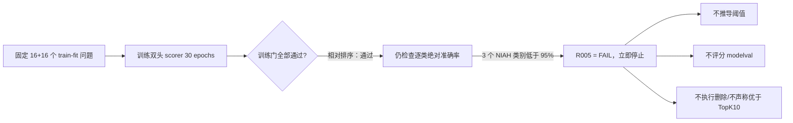

# R005 双头 Selector sanity 正式执行报告

**日期：** 2026-08-12

**正式状态：** `COMPLETE / FAIL`

**实验完整性：** 正式 bundle 当前 runner/finalizer 复验 `PASS`；独立审计 `WARN（P0=0, P1=1）`。唯一 P1 整改项是旧的历史复验次数没有单独保存原始 attestation；另有“确定性合成代理标签”和“policy/safe-corner 路径未执行”的范围 WARN。它们都不改变 R005 `FAIL`

**路线决定：** 当前 v2 计划停止在 R006 之前；默认 TopK10 不变

## 1. 一句话结论

这次不是“模型完全没有学会”，而是：**在固定 train-fit 的 16 个 NIAH 合成 clean/counterfactual 配对上，模型学到了预期的相对方向，但还不能稳定地用一个绝对分界线判断每条证据是否可删。** 这个信号不能外推为自然世界错误信息识别能力。删除是不可逆动作，所以按事前约定，训练门判定 FAIL，不能进入真实删除效果实验。

## 2. 零基础理解：R005 到底在考什么

可以把双头 scorer 想成一个有两只仪表的安检员：

- `protect` 表：这条证据是不是正确答案需要保护的证据；
- `harm` 表：这条证据是不是会误导回答的错误证据；
- 只有“harm 高、protect 低”时，后续 Selector 才可能考虑删除；不确定或两表冲突时必须保留。

这里的“正确/错误”不是人工核验了开放世界中所有事实后的通用真值：NIAH 的 harm 正负监督来自 provenance 严格核验的确定性合成 counterfactual 与对应 clean needle；2Wiki 只有 official supporting evidence 提供 protect-positive，harm 全部 mask，未判断候选也保持 mask。因此 R005 只能检验这套冻结代理标签上的学习链，不能证明模型已经会识别自然世界 misinformation。

R005 先进行一个很小、故意要求模型应该能够记住的 sanity test。它不是在证明模型能泛化，而是在正式花费算力前检查最基本的问题：“训练链是否真的能把已知正确和错误样本分开？”

R005 同时考两种能力：

1. **相对排序：** 同一道题有一条干净证据和一条错误替换证据，模型能否让错误证据的删除安全分更高？
2. **绝对判别：** 不和另一条证据比较时，仅看自己的分数并用冻结的 `0.5` 分界，能否把每个必需类别都分对至少 95%？

这两件事不相同。一个人可以稳定地看出“两只苹果中哪只更坏”，却仍不能可靠判断“一只单独拿来的苹果是否坏到应该扔掉”。Selector 最终必须对单条证据作保留/删除动作，因此只有相对排序正确还不够。

## 3. 正式结果

### 3.1 已通过的部分

- 固定样本覆盖通过：NIAH 16 题、2Wiki 16 题；NIAH 有 16 个严格验证的 clean/counterfactual 配对；
- 完整训练 30/30 epochs、360 次 optimizer step；没有 OOM、NaN 或 Inf；
- 两个独立 sigmoid head 都发生参数更新；
- 2Wiki 的 harm 标签全部 mask，实测 harm head 梯度严格为 0，说明 mask 没有偷偷产生监督；
- 三个有监督的 source/head loss 都下降：
  - NIAH protect：`0.9472 → 0.1807`；
  - NIAH harm：`0.7148 → 0.3767`；
  - 2Wiki protect：`1.2907 → 0.0030`；
- NIAH 16 个配对的三个方向全部为 `16/16=100%`：
  - `protect(clean) > protect(counterfactual)`；
  - `harm(counterfactual) > harm(clean)`；
  - `safe(counterfactual) > safe(clean)`。

这些结果证明训练代码、双头隔离、mask 规则、checkpoint 保存/重载和相对配对信号都在工作。

### 3.2 没有通过的部分

预注册规则要求每一个有合法标签的“数据源 × head × 类别”准确率都 `≥0.95`，不能把不同类别平均后掩盖薄弱项。

| 数据与类别 | 正确数/总数 | 准确率 | 预注册门 | 结论 |
|---|---:|---:|---:|---|
| 2Wiki protect-positive | 32/32 | 100% | ≥95% | PASS |
| NIAH protect-negative | 16/16 | 100% | ≥95% | PASS |
| NIAH protect-positive | 71/79 | 89.87% | ≥95% | FAIL |
| NIAH harm-negative | 12/16 | 75% | ≥95% | FAIL |
| NIAH harm-positive | 14/16 | 87.5% | ≥95% | FAIL |

因此唯一失败检查是 `per-source-head-class-accuracy`，总训练门为 FAIL。

这里的 95% 在分母为 16 时非常严格：`15/16=93.75%`，所以必须 `16/16` 才能通过。这是运行前就写好的安全门。看到结果后把 95% 降低，会让实验从“检验事前假设”变成“按答案修改规则”，因此本次不能这样做。

### 3.3 这个失败说明什么、不说明什么

它直接说明：**当前训练配方在这批固定代理标签小样本上，绝对逐类判别还不够可靠，尤其同时存在“没有充分保护已标注 required evidence”和“NIAH 合成 harm 正负类混淆”的风险。**

它不直接证明失败原因一定是分数校准。完美的配对方向与失败的 0.5 分类门共同提示“模型有相对排序信号，但绝对边界不足”；可能原因包括分数校准、优化目标、样本量/样本难度或表示能力，需要新实验区分，不能在本报告中把一种猜测写成定论。

## 4. 为什么没有继续测试删除和保留的平衡

本计划采用 fail-closed 顺序：只有小样本训练门通过，才允许推导诊断阈值，再一次性评分 403 个 train-modelval 问题，最后才运行 `0–cap1` 删除、safe-corner 和逐题 count-matched 对照。

R005 在第一道训练门就失败，因此程序正确地短路：

- 保存了 640 条分数，但它们严格只是固定 32 个 train-fit 问题的 Top20 分数；
- train-modelval 分数为 0 条；
- 分位点策略标记为 `NOT_EVALUATED_TRAINING_GATE_FAIL`；
- decision trace、selection results、selected sets 和 count-matched controls 均为空；
- `safe_corner=NOT_EVALUATED`；
- 没有读取 sealed600 或 heldout 的 Selector 效果。

所以本轮不能说：

- Selector 已经比 TopK10 提升；
- harmful reduction 为正或其 95% CI 不跨 0；
- recall/complete-chain 损失合格；
- deletion precision 优于逐题等量随机或 bottom-rank；
- 已经找到安全删除角落；
- 已经测试并证明所有安全删除角落都不存在。

准确说法是：**当前 scorer 配方没有获得测试安全删除角落的资格。**

## 5. 前面的实验有没有白做

没有。失败发生在一条很具体的门上，不会把前面已经独立验证的成果全部推翻。

| 阶段 | 仍然可以保留的内容 | 本次失败改变了什么 |
|---|---|---|
| R001 | 六个 Hybrid Top20 pool 的精确恢复、query/document/corpus 对齐、逐文件和逐题 hash | 不改变；失败的不是候选池身份 |
| R002 | 指标定义、component/role 拆分、cluster bootstrap、CRC 规则与样本量 | 不改变；失败的是 scorer，还没有运行 CRC |
| R003 | TopK10/9/8/7 数量基线、TopK9 过删警示、逐题 count-matched 协议 | 协议保留；因为没有真实删除 trace，数值对照继续延期 |
| R004 | 80,460 条标签审计、mask 语义、输入隔离、无截断/OOM/NaN、资源估计 | 保留；R005 进一步证明训练/梯度链可以执行 |
| R005 | 双头实现、fail-closed 门控、checkpoint/manifest/复验链、16/16 相对排序信号 | 当前训练配方不能进入 modelval；checkpoint 仅作 sanity 证据 |
| 历史 Beam/MIS/gated | “激进删除能降 harm，但会严重伤 recall”的失败边界 | 仍只能作为负面经验，不能冒充 v2 正式正结果 |

从论文抽取的三个核心原则也没有因本次 FAIL 失效：

- Provence/NEST 启发的“每题动态但有限删除”仍是后续策略形式；本次还没有走到删除阶段；
- SetR/Beam Retrieval 启发的“保护完整证据集合/链”仍是离线硬指标；本次没有资格运行该指标；
- Conformal Risk Control 启发的“独立 calibration + P0 回退”仍是后续安全选择层；CRC 本身不会让 scorer 变准确。本次按分阶段协议不运行 CRC，当前 scorer 也不能为任何非零删除策略提供依据；唯一结构安全回退仍是 P0/TopK10。

## 6. 正式证据与可复验性

### 6.1 唯一正式运行

- 服务器目录：`/scratch/fl25387/IBM_Granite_Project_latest/runs/selector-adaptive-risk-v1/R005`
- 生成 Git commit：`33c95a84c4edeb6d9ec85a3fa74cbf9d62fc0e3b`
- 分支：`refactor/three-module-baseline`
- Git 状态：clean
- GPU：NVIDIA RTX A4000，float32
- wall time：`240.7973 s`
- 峰值 allocated GPU memory：`4,440,976,896 bytes`
- 正式目录：精确 16 个文件；无 symlink

关键哈希：

| 对象 | SHA-256 |
|---|---|
| 顶层 `selector_experiment_manifest.json` | `3d5707358cd4a02f96b094c71ae5910b2c769ca90311583127a88c13ac203a5a` |
| `CHECKSUMS.sha256` 文件 | `384e54dac8e3871e41c58ef55638243df6454cb990ccabe5a0fddad0f8522567` |
| `sanity_manifest.json` | `3c9e0d890068ce0765a099f57b3f1944507ec22ed270d429dc3ac5b585640063` |
| `sanity_report.json` | `7f60c4b490d36f16e119dbfbdc0d6d8601ea4ba1794c502bc36cc74d4b130ec9` |
| checkpoint 文件 | `2b3493285d170885d5ff2c6f5364e4c9bc1f8176bcdf6eda4c081d0ec1010fb7` |
| checkpoint 加载后 state fingerprint | `6ec87f8f07cb0275b28d7fbf126ea14d5992683988b28ddae52f300dcfe8d0bd` |

checkpoint 文件为 `735,356,896 bytes`，不进入普通 GitHub Git 历史；完整 bundle 保存在服务器，GitHub 同步执行代码、本报告、配置与上述内容哈希。文件 SHA 与加载后模型状态 fingerprint 含义不同，二者已分别记录。

完整 runner `--verify-only` 会重新加载 checkpoint、重建固定样本和标签并重算 640 条分数；finalizer `--verify-only` 会复核文件集合、manifest、输入 pin 与 checksums。二者已于 2026-08-12 在同一 pinned server 环境重新执行并退出 `0`，命令、commit、输出、退出码与复验后哈希已保存到 [`R005_VERIFICATION_ATTESTATION_2026-08-12.md`](R005_VERIFICATION_ATTESTATION_2026-08-12.md)。新的独立审计见 [`R005_EXPERIMENT_INTEGRITY_AUDIT_2026-08-12.md`](R005_EXPERIMENT_INTEGRITY_AUDIT_2026-08-12.md)：它支持 formal `COMPLETE / FAIL` 与停止决定，`P0=0`；同时把此前只在工作记录中写到、但没有保存原始 reviewer/verifier 输出的历史次数标为 `P1/WARN`。因此不再把那些历史次数写成已被本 bundle 独立证明。

### 6.2 未发布的技术运行

正式运行前暴露过四个工程问题：共享修改 R004 配置、把源数据超集误当成必须与标注 universe 全等、数学等价浮点公式的逐位比较差异、以及合法 JSON array 到 strict tuple 的反序列化错误。前三次在模型结果产生前被完整性保护拦截；它们不是实验结果。

commit `26fa422` 的一次运行完成训练并得到同样的逐类 FAIL，但它的独立 runner verify-only 被反序列化错误阻断，所以没有发布为正式 R005，而是完整保留在服务器 `R005.unverified-26fa4221`。它与正式运行的五项准确率、16/16 配对方向和失败原因一致，只可作为结果稳定性的旁证，不能叫第二个正式 run、独立 seed，也不能用于合并统计。

## 7. 当前项目状态

- R001：PASS
- R002：PASS
- R003：PASS
- R004：PASS
- R005：FAIL（正式 bundle 当前双重复验 PASS；独立审计 WARN，P0=0、历史 attestation 留存 P1=1）
- R006–R015：当前 v2 路线 `CUT / NOT RUN`
- 生产默认：仍为 TopK10；没有注册或上线新的 Selector

这正是预注册停止门的作用：在模型还可能误删正确证据时，先损失一次小实验，而不是把风险带进全量训练、modelval、decision-dev 或最终测试。

## 8. 如果继续，下一步应怎样重新立项

不能直接运行 R006，也不建议只把 95% 或 0.5 改松后重跑。更合适的是先提交一个新的事前 amendment，并给新实验独立 Run ID。建议把下一阶段拆成两步：

1. **只读诊断，不产生成功声明。** 已用公开的 R005 train-fit 分数完成错误、分布、配对 margin 与阈值可行性检查；详见 [`R005_POSTHOC_DIAGNOSIS_2026-08-12.md`](R005_POSTHOC_DIAGNOSIS_2026-08-12.md)。它确认任何单一阈值都不能满足原门，并发现当前实现没有使用 snapshot 已有的 NLI pooler/classifier 路径；这些仍只用于提出新假设，不能把 R005 改判 PASS。
2. **新的、未看结果的数据门。** 新 amendment 应先保留现实现作对照，再单独测试“恢复预训练 NLI pooling/初始化”，只有这两者都失败才加入一个预冻结的 clean/counterfactual pairwise objective。训练、阈值拟合、方法筛选与独立确认使用 component-disjoint 角色；新门继续逐类报告，不能用总体平均掩盖。只有新 scorer 先通过独立 sanity confirmation，才允许另行恢复 `0–cap`、safe-corner、等量删除对照和后续 CRC 路线。

这样做利用了本次最有价值的信号——相对配对方向已经完全正确——同时不把“可能是校准问题”提前当成事实。任何新的 epoch、loss、阈值或样本规则都必须在看到新结果前冻结，并且不得用本次 sanity checkpoint 初始化 R006。
